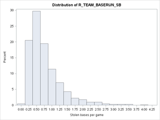
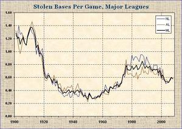
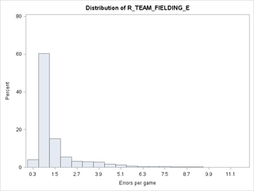
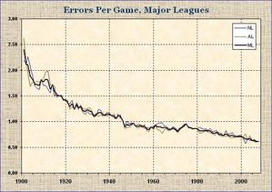
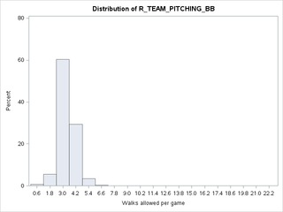
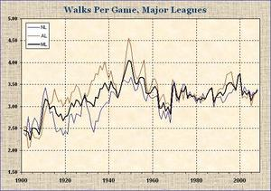
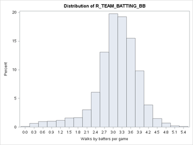
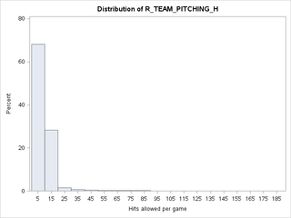
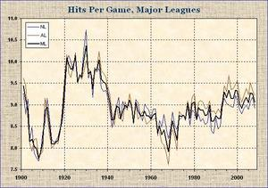
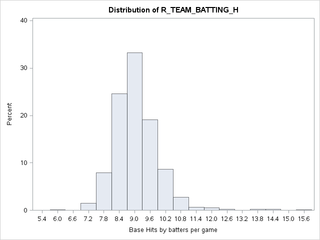

% Assignment 1: Moneyball
% Andrew G. Dunn^1^
% ^1^andrew.g.dunn@u.northwestern.edu

\vfill

**Andrew G. Dunn, Northwestern University Predictive Analytics Program**

Prepared for PREDICT-411: Generalized Linear Models.

Formatted using the \LaTeX\, references managed using pandoc-citeproc.

\newpage

# Background

This data set contains approximately 2200 records. Each record represents a
professional baseball team from the years 1871 to 2006 (inclusive). Each record
has the performance of the team for the given year, with all of the statistics
adjusted to match the performance of a 162 game season. We plan to use Ordinary
Least Squares (OLS) regression to predict a number of wins for a team. We will
construct multiple models, and select a single model based on both its
comparative criteria, as well as interpret-ability. The data manipulation steps,
as well as the elicited parameters from the model, will be designed into a
scoring routine. This routine, provided a data set to test with, will yield a
new data set that indicates the expected values from our model. We are provided
with two data sets, one for training our model, the other to feed into our
scoring routine.

An initial observation; that these data occurred during a long span of time, and
that the data itself doesn't provide a variable to indicate time. As we consider
the period of 1871 to 2006, it seems unlikely that this data set is comprised of
homogeneous records around the same phenomena. It seems more likely that the
nature of what is being measured, the game of baseball, has experienced some
change over that period that likely manifests in the data. As we move further
into examining the data, we will keep an eye out for outliers. For we may not
want to merely throw these away, as they may be indication of previous ways in
which baseball was being played.

We observe that we've been prepared for this analysis in our previous course
(410) imbuing techniques for dummy coding, automatic variable selection, and
dimensionality reduction. These techniques, while fundamental, are merely tools
that need to be wielded in the hands of a modeler with the stomach for
exploring, thinking, and preparing the data. Our hope is that through
exploratory data analysis we can become intimate the data, and use some of our
pre-processing techniques to create a set of variables that will perform well
when we move into model selection.

# Exploratory Data Analysis

Our plan for gaining some insight into building models for this data set will be
to pursue the following inquiries:

 - Examine the data, as well as the data dictionary. Fix any errors (e.g. label-switching)
 - Consider the arithmetic relationship between variables (e.g. combining or decomposing), as well as contextual relationships between variables (e.g. variables that represent conceptually opposite measurements)
 - Understand what data is missing
 - Understand the initial relationship variables have with our dependent variable (e.g. correlation)
 - Impute interesting (correlated) variables that have missing data
 - Examine variable distributions and consider further imputation or indicator coding (e.g. outliers)
 - Re-examine relationship between re-expressed/imputed independent variables and dependent variable
 - Begin model construction

There are two data sets provided, one is our training data set comprised of 2276
observations. The other is a testing data set comprised of 259 observations.
We'll begin our exploratory data analysis (EDA) by examining the variables
provided to us in the data dictionary.

| Variable Name | Definition | Proposed Theoretical Effect |
|:-------------:|:----------:|:---------------------------:|
| TEAM_BATTING_H   | Base Hits by batters (1B,2B,3B,HR) | Positive Impact on Wins |
| TEAM_BATTING_2B  | Doubles by batters (2B) | Positive Impact on Wins |
| TEAM_BATTING_3B  | Triples by batters (3B) | Positive Impact on Wins |
| TEAM_BATTING_HR  | Homeruns by batters (4B) | Positive Impact on Wins |
| TEAM_BATTING_BB  | Walks by batters | Positive Impact on Wins |
| TEAM_BATTING_HBP | Batters hit by pitch (get a free base) | Positive Impact on Wins |
| TEAM_BATTING_SO  | Strikeouts by batters | Negative Impact on Wins |
| TEAM_BASERUN_SB  | Stolen bases | Positive Impact on Wins |
| TEAM_BASERUN_CS  | Caught stealing | Negative Impact on Wins |
| TEAM_FIELDING_E  | Errors | Negative Impact on Wins |
| TEAM_FIELDING_DP | Double Plays | Positive Impact on Wins |
| TEAM_PITCHING_BB | Walks allowed | Negative Impact on Wins |
| TEAM_PITCHING_H  | Hits allowed | Negative Impact on Wins |
| TEAM_PITCHING_HR | Homeruns allowed | Negative Impact on Wins |
| TEAM_PITCHING_SO | Strikeouts by pitchers | Positive Impact on Wins |

Table: Data Dictionary with Proposed Theoretical Effect

Firstly, we can feel somewhat confident that this data has been prepared for
analysis as we notice that the variable labels are consistent and there doesn't
appear to be any mistake label-switching. We see that each variable is
continuous, and appears to be a count of a specific metric. We also notice that
some of these metrics could likely be arithmetically combined, such as computing
the number of '1B' hits by taking the difference between overall hits and '2B',
'3B', 'HR'. We can only reasonably infer these combinations from the data
dictionary, or, potentially, common metrics that are used within this industry.
As we have little experience with the industry of baseball, we'll limit
ourselves to the provided variables, and derivative variables made from them
(such as rates, knowing that the data has been prepared so that we can assume a
162 game season for each record). We will attempt to remain diligent to
potential relationships between variables that can be explored, where one
variable can help to provide context for examining another variable.

Some examples of these presumed relationships are:

 - TEAM_BATTING_H & TEAM_PITCHING_H (Hits Gained / Hits Allowed)
 - TEAM_BATTING_BB & TEAM_PITCHING_BB (Walks Gained / Walks Allowed)
 - TEAM_BATTING_HR & TEAM_PITCHING_HR (Homeruns Gained / Homeruns Allowed)

We have some expectation that by looking at the descriptive statistics of one of
these variables, we would be able to compare those to the descriptive statistics
of the other variable and have contextually informed observations.

\newpage

## Missing Data

We'll next consider missing data, if we have missing data we have to decide if
we're going to use the variable, and if so we will need to impute the variable
because our chosen modeling method cannot withstand missing observations.

| Variable Name | N | N Missing | Mean | Definition |
|:-------------:|:-:|:---------:|:----:|:----------:|
| TARGET_WINS      | 2276 | 0 | 80.7908612 | |
| TEAM_BATTING_H   | 2276 | 0 | 1469.27 | Base Hits by batters (1B,2B,3B,HR) |
| TEAM_BATTING_2B  | 2276 | 0 | 241.2469244 | Doubles by batters (2B) |
| TEAM_BATTING_3B  | 2276 | 0 | 55.2500000 | Triples by batters (3B) |
| TEAM_BATTING_HR  | 2276 | 0 | 99.6120387 | Homeruns by batters (4B) |
| TEAM_BATTING_BB  | 2276 | 0 | 501.5588752| Walks by batters |
| TEAM_BATTING_HBP | 191 | 2085 | 59.3560209 | Batters hit by pitch (get a free base) |
| TEAM_BATTING_SO  | 2174 | 102 | 735.6053358 | Strikeouts by batters |
| TEAM_BASERUN_SB  | 2145 | 131 | 124.7617716 | Stolen bases |
| TEAM_BASERUN_CS  | 1504 | 772 | 52.8038564 | Caught stealing |
| TEAM_FIELDING_E  | 2276 | 0 | 246.4806678 | Errors |
| TEAM_FIELDING_DP | 1990 | 286 | 146.3879397 | Double Plays |
| TEAM_PITCHING_BB | 2276 | 0 | 553.0079086 | Walks allowed |
| TEAM_PITCHING_H  | 2276 | 0 | 1779.21 | Hits allowed |
| TEAM_PITCHING_HR | 2276 | 0 | 105.6985940| Homeruns allowed |
| TEAM_PITCHING_SO | 2174 | 102 | 817.7304508 | Strikeouts by pitchers |

Table: Missing and Means

We see that we're missing data in a couple variables. We'll temporarily stash
that realization so that we can explore further on whether we should consider
imbuing these variables for use in our model. We'll look at correlation between
the provided variables and TARGET_WINS:

| Variable Name | Correlation | Proposed Theoretical Effect |
|:-------------:|:-----------:|:---------------------------:|
| TEAM_BATTING_H   | 0.38877 | Positive Impact on Wins |
| TEAM_BATTING_2B  | 0.28910 | Positive Impact on Wins |
| TEAM_BATTING_3B  | 0.14261 | Positive Impact on Wins |
| TEAM_BATTING_HR  | 0.17615 | Positive Impact on Wins |
| TEAM_BATTING_BB  | 0.23256 | Positive Impact on Wins |
| TEAM_BATTING_HBP | 0.07350 | Positive Impact on Wins |
| TEAM_BATTING_SO  | -0.03175 | Negative Impact on Wins |
| TEAM_BASERUN_SB  | 0.13514 | Positive Impact on Wins |
| TEAM_BASERUN_CS  | 0.02240 | Negative Impact on Wins |
| TEAM_FIELDING_E  | -0.17648 | Negative Impact on Wins |
| TEAM_FIELDING_DP | -0.03485 | Positive Impact on Wins |
| TEAM_PITCHING_BB | 0.12417 | Negative Impact on Wins |
| TEAM_PITCHING_H  | -0.10994 | Negative Impact on Wins |
| TEAM_PITCHING_HR | 0.18901 | Negative Impact on Wins |
| TEAM_PITCHING_SO | -0.07844 | Positive Impact on Wins |

Table: Correlation to TARGET_WINS

Firstly, we're a bit sad that out of the gate we don't see any variable that is
particularly correlated with TARGET_WINS. We observer that the sign of the
correlation roughly matches up with our initial 'Proposed Theoretical Effect';
with BATTING_SO, FIELDING_E, and PITCHING_H indicating a negative correlation.
We're however surprised to see PITCHING_HR, and PITCHING_BB have the opposite
sign that we would expect.

From this, we surmise that we're going to initially abandon imputing values for
BATTING_HBP due to an out of the gate low correlation to TARGET_WINS. We'll take
the same stance on BATTING_SO, BASERUN_CS, FIELDING_DP, and PITCHING_SO. This
leaves us with needing to impute BASERUN_SB.

We'll examine the distribution of each remaining variable via a histogram, as
well as test statistics for normality that include a series of goodness-of-fit
tests based on the empirical distribution function. Unfortunately, despite how
each variable appears in a histogram, our goodness-of-fit tests (Kolmogorov-
Smirnov, Cramer-von Mises, Anderson-Darling) indicate that we should not reject
the null hypothesis, which tells us that our variables are normally distributed.
We say unfortunately because the visual examination of the variables as
histograms shows wildly differing from expected normal shapes for several
variables.

We'll impute the BASERUN_SB variable with the existing mean ($124.761772$). We
will create two new variables in this process; one with the IMP_* prefix for the
imputed variable (leaving the original variable untouched), and one with the
I_IMP_* prefix as an indicator variable for the imputed variable.

\newpage

## Reasoning with the Distributions / Examining Extrema

Some of the other variables have an alarming shape to their distribution, with
indication that there are some extreme values. As we stated before, we don't
have a particularly good 'feel' for the game of baseball. We certainly don't
have the ability to easily interpret an observation over a 162 game season, but
we have seen a game or two so we would be better off converting these variables
into rates. We create several new variables with the R_* prefix to indicate
rate.

In examining these variables we are not able to reason through the means and
extrema considering if that measurement would happen on average 'this many'
times in each game of the season. As this type of measurement is more palatable
to reason through, we can compare what we're seeing in these metrics with what
is known from historical references found on-line. We have to be careful when we
begin looking on-line as we don't much about this data set, such as what league
these data are observed from. We are looking for values that appear to be so
extreme that we should simply imputate them, or should consider that they might
be from a different population within this data set. With this line of reasoning
we're immediately confronted with what seems to be unreasonable seasonal
averages for a couple variables:

_We're going to consider historical reference data from a single source, in
reality we would want to ensure that we corroborate between multiple sources and
consider and regulatory/statutory limitations in our industry for seeking
outside information. The source used is Michael Bein's 'Century at a Glance'
[Graphical History of Baseball](http://michaelbein.com/baseball.html). We
further acknowledge that we don't know if our data set is sampled from major
league games, which is where our reference information is sampled from._

\newpage

### Stolen Bases

R_TEAM_BASERUN_SB has a mean of 0.77 but we're seeing a long tale of values
between 1.8 and 4.0.

Looking to our aforementioned reference we see that over the century there were
values no greater than 1.5 stolen bases per game with a rough mean at 0.8 stolen
bases per game.

\newpage

### Fielding Errors

R_TEAM_FIELDING_E has a mean of 1.51 but we're seeing a long tale of values
between 3 and 11.

Looking again at our reference, we see that over the century there were never
any more than 3 errors per game, as well as the mean seems to be near 1.5.

\newpage

### Pitching Walks Allowed

R_TEAM_PITCHING_BB has a mean of 3.41 but has a long tail that seems to have
pretty extreme values out to 22.0.

Looking again at our reference, we see that over the century there is around a
3.4 mean for walks per game. We also remember back to our observation that some
variables should be able to provide context for us, specifically TEAM_BATTING_BB
& TEAM_PITCHING_BB (Walks Gained / Walks Allowed).

\newpage

Looking back to R_TEAM_BATTING_BB we see that the mean is 3.09 and the
distribution appears to be strongly centered around 3.4. We will choose to infer
that these two 'offensive' and 'defensive' variables should appear to be similar
to each-other.

\newpage

### Pitching Hits Allowed

Lastly, we'll look at R_TEAM_PITCHING_H which as a mean of 10.98 but has an
extremely long tail that has values up in the 180 range.

Our reference gives us some insight that those values are quite extreme. We see
that the reference data has a likely mean around 9.5, with its most extreme
values not to exceed 11.0. If we consider looking back to TEAM_BATTING_H &
TEAM_PITCHING_H (Hits Gained / Hits Allowed) we can make a comparison, as we
believe that these two variable should provide context for one another.

\newpage

We see that R_TEAM_BATTING_H has a much more normal distribution visually, and
that there isn't any extreme values beyond 16.0.

### Remarks on Extreme Observations found in Variables

We consider the above variables both from a exterior reference and interior
context. We notice that there are many alarmingly extreme values in
R_TEAM_BASERUN_SB, R_TEAM_FIELDING_E, R_TEAM_PITCHING_BB, and R_TEAM_PITCHING_H.
For each of these variables we have to decide whether we consider these extrema
something that needs to be addressed. We also notice asymmetric distributions in
R_IMP_TEAM_BASERUN_SB, R_TEAM_BATTING_3B, R_TEAM_BATTING_BB, R_TEAM_BATTING_H,
R_TEAM_BATTING_HR, and R_TEAM_PITCHING_HR. From our studies we know that we have
several options:

 - Truncating at a specific value (or set of values, e.g. ranges)
 - $\log$ transformations
 - Standardization (e.g. Z-Score)
 - Binning (e.g. Buckets, Quantiles)
 - Combining above techniques (e.g. $log$ followed by binning)

We are committed to using the OLS regression as our model, so we cannot simply
choose to alter our modeling technique in the face of the extreme values. Even
though this is an assignment, there are many industries that have regulatory
limitations that would prevent one from pursuing a different model out of
convenience. We are also committed to producing a single model, which means that
we're likely to take a less complex approach to binning the data into highly
segmented groups. This restriction is self imposed due to time and complexity,
and may be significantly limiting if our data in fact has multiple segmented
populations that would better be fit with multiple models.

Given this, we will move into the data preparation phase and transform the
variables into what we feel is going to be the most useful set for our modeling
exercise.

\newpage

# Data Preparation

Considering the above variables, we will immediately eliminate TEAM_BASERUN_SB
(or the rate expressed equivalent) due to its low correlation to TEAM_WINS
(0.01484). This leaves us with TEAM_FIELDING_E, TEAM_PITCHING_BB, and
TEAM_PITCHING_H to be prepared further for modeling due to their extreme values.

We at first want to use an approach of creating indicator variables at specific
thresholds derived from interior and exterior context. We plan to use these
indicator variables to supplement the original rate variable in an analysis of
covariance. Our intuition is that these context derived thresholds for outliers
are indications of different populations within the data, and that by segmenting
them through an indicator variable we can better model their presence.

For R_TEAM_FIELDING_E, we feel confidently from looking at our outside source
that values greater than 3.0 (an average of greater than 3.0 errors per game)
are likely outliers. We will choose to create an indicator variable that will be
0.0 when R_TEAM_FIELDING_E is below 3.0, and 1.0 when R_TEAM_FIELDING_E is
greater than or equal to 3.0.

For R_TEAM_PITCHING_BB, we feel strongly from looking at our outside source that
values greater than 5.0 (an average of greater than 5.0 walks by batters per
game) is likely an outliers. We however examine the R_TEAM_BATTING_BB
distribution and consider moving our threshold to 5.4. We do this because we
want to derive what context we can from the actual data set, rather than data
exclusively from outside of our data set. We will choose to create an indicator
variable that will be 0.0 when R_TEAM_PITCHING_BB is below 5.4, and 1.0 when
R_TEAM_PITCHING_BB is greater than or equal to 5.4.

For R_TEAM_PITCHING_H, we feel strongly from looking at our outside source that
values greater than 11.0 (an average of greater than 11.0 hits allowed per game)
is likely an outlier. We howeever examine the R_TEAM_BATTING_H and consider
moving out threshold to 12.6 to encompass the far right of the R_TEAM_BATTING_H
distribution. We once again do this because we want to use the internal data set
context for setting these thresholds. We will choose to create an indicator
variable that will be 0.0 when R_TEAM_PITCHING_H is below 12.6, and 1.0 when
R_TEAM_PITCHING_H is greater than or equal to 12.6.

For the asymmetric looking distributions, we will create log and square root
transformations of each variable, examine them, and only retain the
transformations that have a generally symmetrical bell shape about them. We find
that the log transform of R_IMP_TEAM_BASERUN_SB is the most symmetrical
expression of that variable. We find that the log transform of R_TEAM_BATTING_3B
is the most symmetrical expression of that variable. We find that neither sqrt
or log transformation make R_TEAM_BATTING_BB more symmetrical. We find that the
log transform of R_TEAM_BATTING_H is the most symmetrical expression of that
variable. We find that neither sqrt or log transformation make R_TEAM_BATTING_HR
more symmetrical. We find that the sqrt transformation of R_TEAM_PITCHING_HR is
the most symmetrical expression of that variable.

\newpage

We'll now move into modeling with the variables that we have created. We plan to
take forward any variable that was above the 0.10 threshold for correlation with
TEAM_WINS:

| Variable Name | Definition |
|:-------------:|:----------:|
| I_IMP_TEAM_BASERUN_SB | indicator of imputation for IMP_TEAM_BASERUN_SB |
| I_R_TEAM_FIELDING_E   | Outlier Indicator for Errors per game |
| I_R_TEAM_PITCHING_BB  | Outlier Indicator for Walks allowed per game |
| I_R_TEAM_PITCHING_H   | Outlier Indicator for Hits allowed per game |
| log_R_IMP_TEAM_BASERUN_SB | log transform of impute TEAM_BASERUN_SB with mean per game |
| R_TEAM_BATTING_2B  | Doubles by batters per game |
| log_R_TEAM_BATTING_3B  | log transform of Triples by batters per game |
| R_TEAM_BATTING_BB  | Walks by batters per game |
| log_R_TEAM_BATTING_H   | log transform of Base Hits by batters per game |
| R_TEAM_BATTING_HR  | Homeruns by batters per game |
| R_TEAM_FIELDING_E  | Errors per game |
| R_TEAM_PITCHING_BB | Walks allowed per game |
| R_TEAM_PITCHING_H  | Hits allowed per game |
| sqrt_R_TEAM_PITCHING_HR | sqrt transform of Homeruns allowed per game |

Table: Variables taken into Modeling Stage

# Modeling

Initially we will examine our variables with outliers above. We're quite
unfamiliar with the method of using indicator/dummy variables to segment our
data when we think we have multiple populations (outliers). So our first
modeling step is going to be building six models, a pair for each variable that
we've created indicator variables for above. We want to examine whether our
goodness-of-fit criteria is changing for the better when we model both the
original variable and the indicator as dependent variables.

Thus we construct the models, and get goodness of fit information below (we are
currently excluding other information, such as coefficients, because we are not
yet interpreting the model but merely evaluating the technique):

| Model | Adjusted $R^2$ |
|:------|:--------------:|
| $\text{TARGET\_WINS} = \text{R\_TEAM\_FIELDING\_E}$ | 0.0307 |
| $\text{TARGET\_WINS} = \text{R\_TEAM\_FIELDING\_E} + \text{I\_R\_TEAM\_FIELDING\_E}$ | 0.0537 |
| $\text{TARGET\_WINS} = \text{R\_TEAM\_PITCHING\_BB}$ | 0.0150 |
| $\text{TARGET\_WINS} = \text{R\_TEAM\_PITCHING\_BB} + \text{I\_R\_TEAM\_PITCHING\_BB}$ | 0.0269 |
| $\text{TARGET\_WINS} = \text{R\_TEAM\_PITCHING\_H}$ | 0.0117 |
| $\text{TARGET\_WINS} = \text{R\_TEAM\_PITCHING\_H} + \text{I\_R\_TEAM\_PITCHING\_H}$ | 0.0214 |

Table: Analysis of Covariance as technique

In each case the use of the indicator variable increase the amount of
variability explained by the model. We are happily surprised to see that this
could be a valuable approach to building our model. If we include any of the
above variables, we will be careful to include the associated indicator
variable.

We examine the goodness-of-fit criteria for our transformed variables, comparing
them to the non-transformed versions of themselves:

| Model | Adjusted $R^2$ |
|:------|:--------------:|
| $\text{TARGET\_WINS} = \text{R\_IMP\_TEAM\_BASERUN\_SB}$ | 0.0147 |
| $\text{TARGET\_WINS} = \text{log\_R\_IMP\_TEAM\_BASERUN\_SB}$ | 0.0120 |
| $\text{TARGET\_WINS} = \text{R\_TEAM\_BATTING\_3B}$ | 0.0199 |
| $\text{TARGET\_WINS} = \text{log\_R\_TEAM\_BATTING\_3B}$ | 0.0130 |
| $\text{TARGET\_WINS} = \text{R\_TEAM\_BATTING\_H}$ | 0.1508 |
| $\text{TARGET\_WINS} = \text{log\_R\_TEAM\_BATTING\_H}$ | 0.1585 |
| $\text{TARGET\_WINS} = \text{R\_TEAM\_BATTING\_HR}$ | 0.0306 |
| $\text{TARGET\_WINS} = \text{log\_R\_TEAM\_BATTING\_HR}$ | 0.0197 |
| $\text{TARGET\_WINS} = \text{R\_TEAM\_PITCHING\_HR}$ | 0.0353 |
| $\text{TARGET\_WINS} = \text{sqrt\_R\_TEAM\_PITCHING\_HR}$ | 0.0394 |

Table: Comparing variables to their transformed selves

We're not very impressed with the results of this comparison. Given, we're only
looking at Adjusted $R^2$ as a metric for goodness-of-fit. We still we're
expecting to get more variability explained by the model when we transformed the
independent variables to be more symmetric/normal in appearance. As it stands it
looks like the only variable that benefited from transformation was
R_TEAM_BATTING_H.

At this time, we feel like we've done everything within our ability and studies
to prepare the variables. We're certainly perplexed and disappointed that there
doesn't appear to be a single variable that has allows us to build an initial
model that explains a large amount of variability in our data set. We've even
tried re-expression of the dependent variable in a variety of ways but have not
seen enough of a benefit to pursue in detail within the write up.

We will take what we have to work with in this data set and construct some
models, interpret their coefficients, and construct a model deployment procedure
for our choice model.

\newpage

# Model Comparison

We're going to build two models and interpret the coefficients. For the first
model we're going to select variables by hand based on their correlation and
interpret-ability. For the second model we will use a smattering of automated
variable selection techniques, then bring over the model that we feel performs
the best while also being interpretable.

For our first model, we'll use the following variables based on their
correlation with out intended dependent variable, the model is:

$$Y = \beta_0 + \beta_0 + \beta_1X_1 + \beta_2X_2 + \beta_2X_2 + \beta_3X_3 + \beta_4X_4 + \epsilon$$

Where:

| In Model | In Data |
|:---------|:--------|
| $Y$ is | \text{TARGET\_WINS} |
| $X_1$ is | \text{log\_R\_TEAM\_BATTING\_H} |
| $X_2$ is | \text{R\_TEAM\_BATTING\_2B} |
| $X_3$ is | \text{R\_TEAM\_BATTING\_BB} |
| $X_4$ is | \text{R\_TEAM\_BATTING\_HR} |

And the respective fit coefficients is:

| Coefficent | Value | t-value | $\text{Pr} > |t|$ |
|:-----------|:-----:|:-------:|:-----------------:|
| $\beta_0$ | -93.82574 | -11.59 | <.0001 |
| $\beta_1$ | 73.62327 | 18.20 | <.0001 |
| $\beta_2$ | -3.08370 | -2.11 | 0.0345 |
| $\beta_3$ | 4.67320 | 10.36 | <.0001 |
| $\beta_4$ | 3.21896 | 3.20 | 0.0014 |

We're using the rate variables to construct our model. This means that we must
interpret a change in the independent variable to be a change in the average
performance for that metric per game rather than for the entire 162 game season.

We will interpret as when all dependent variable coefficients are zero the team
will have negative wins. Very likely not a good model start, as the
interpretation becomes wonky. The first coefficient ($\beta_1$) is log
transformed, meaning that a one percent increase in the independent variable is
associated with a $\frac{73.623}{100}$ unit increase in target wins. The next
variables are not transformed, so we can say that a one unit increase in the
number of doubles per game will result in a -3.083 decrease in the target wins.
A one unit increase in the number of walks by batters per game will result in a
4.673 increase in the target wins. A one unit increase in the number of homeruns
by batters per game will result in a 3.218 increase in the target wins.

Overall, we really don't like this model. It doesn't 'feel' right, so we plug in
the means for each one of these variables and see that it produces near the mean
of the TARGET_WINS variable (as to be expected).

And the goodness-of-fit diagnostics are:

| Source | |
|:-:|:-:|
| Root MSE | 13.88675 |
| R-Square | 0.2242 |
| Adj R-Square | 0.2228 |
| F Value | 164.06 |

Which are not overly impressive. This model in effect can account for 22% of the
variability that we're seeing in the training data set. We're accustomed to
working with data sets where we can build models that have much higher goodness-
of-fit diagnostics without nearly the amount of effort put into this model.

You may notice that we excluded the TEAM_PITCHING_HR variable. We couldn't get
the variable to contribute any more to the model and remain statistically
significant. If we used sqrt transformation the $p$-value was not statistically
significant, if we used log transformation the Adjusted $R^2$ of the model went
down noticeably.

We also took the time to tack on the three variables that we enumerated as
having outliers that will be modeled by using analysis of covariance. Initially
this model was ten independent variables (four from above, plus the three
'outlier' variables and their indicator variables), but we couldn't get all of
the independent variables to be statistically significant. After using automated
variable selection we surprisingly narrowed down to this model:

$$Y = \beta_0 + \beta_0 + \beta_1X_1 + \beta_2X_2 + \beta_2X_2 + \beta_3X_3 + \beta_4X_4 + \beta_5X_5 + \beta_6X_6 + \epsilon$$

Where:

| In Model | In Data |
|:---------|:--------|
| $Y$ is | \text{TARGET\_WINS} |
| $X_1$ is | \text{log\_R\_TEAM\_BATTING\_H} |
| $X_2$ is | \text{R\_TEAM\_BATTING\_2B} |
| $X_3$ is | \text{R\_TEAM\_FIELDING\_E} |
| $X_4$ is | \text{I\_R\_TEAM\_FIELDING\_E} |
| $X_5$ is | \text{R\_TEAM\_PITCHING\_BB} |
| $X_6$ is | \text{I\_R\_TEAM\_PITCHING\_BB} |

And the respective fit coefficients is:

| Coefficent | Value | t-value | $\text{Pr} > |t|$ | VIF |
|:-----------|:-----:|:-------:|:-----------------:|:---:|
| $\beta_0$ | -107.05903 | -13.60 | <.0001 | 0 |
| $\beta_1$ | 91.54902 | 21.90 | <.0001 | 1.93570 |
| $\beta_2$ | -7.48343 | -5.41 | <.0001 | 2.00777 |
| $\beta_3$ | -6.40908 | -15.31 | <.0001 | 4.35876 |
| $\beta_4$ | 14.83384 | 8.89 | <.0001 | 3.61252 |
| $\beta_5$ | 1.66236 | 4.85 | <.0001 | 1.55933 |
| $\beta_6$ | -7.00469 | -2.41 | 0.0158 | 1.60379 |

And the goodness-of-fit diagnostics are:

| Source | |
|:-:|:-:|
| Root MSE | 13.44874 |
| R-Square | 0.2730 |
| Adj R-Square | 0.2711 |
| F Value | 142.00 |

Once again, not overly impressive. We were happy that we've increased the
'performance' of our model. This model is a bit more complex to interpret
because we've incorporated the indicator/dummy variables. We created another
model that combined all of our outliers indicators into a single indicator
variable for easier interpret-ability, but the goodness-of-fit diagnostics were
not as good as the model we've created above.

We first look at our two indicator variables. These variables are
meant to represent where we think there is segmented populations within our
data. In both cases we consider the 0 case to be the more 'normal' data, and the
1 case to be the 'outlier' data that we suspect may come from a sub-population.
In this case $\text{I\_R\_TEAM\_FIELDING\_E}$ tells us that the mean difference
in TARGET_WINS between our 'normal' and 'outlier' sub-populations is 14.83.
Similarly, for \text{I\_R\_TEAM\_PITCHING\_BB} the mean difference in
TARGET_WINS between our 'normal' and 'outlier' sub-populations is -7.

The parameter $\text{log\_R\_TEAM\_BATTING\_H}$ is log transformed meaning that
a one percent increase in the independent variable is associated with a
$\frac{91.54902}{100}$ unit increase in target wins. The parameter
$\text{R\_TEAM\_BATTING\_2B}$ is not transformed so we can say that a one unit
increase in the number of doubles per game will result in an average increase
(actual decrease) of -7.48343 target wins. The parameter
$\text{R\_TEAM\_FIELDING\_E}$ is also not transformed so we can say a one unit
increase in the number of fielding errors per game will result in an average
increase (actual decrease) of -6.40908 target wins. The parameter
$\text{R\_TEAM\_PITCHING\_BB}$ is also not transformed so we can say a one unit
increase in the amount of walks allowed per game will result in an average
increase of 1.66236 target wins.

We notice that $\text{R\_TEAM\_FIELDING\_E}$ has a VIF greater than 4, which
normally would be cause for investigation. However, due to how convoluted this
model was we're likely not going to use it.

# Model Remarks and Selection

Between all of the models constructed, many of which are not documented in this
report, we have to consider that our expected predictive ability on this data
set is likely going to be quite low. It is highly likely that we're observing
Simpson's Paradox, which states that: 'what is true for the whole population may
not be true for any of the subpopulations'. We're pretty confident that we are
seeing multiple sub-populations within this data, likely due to how long of a
period the data was being collected over. Our attempts at trying to isolate this
phenomena by using dummy coded variables don't seem to have paid off with better
models, and certainly convolute the interpretation of the model. We tried to
combine the positive dummy variables into a single dummy variable that was the
inclusive set, however incorporating this variable gave us poorer goodness-of-
fit diagnostics.

All in all, we're going to go with our simplest model that performed
'adequately':

$$Y = \beta_0 + \beta_0 + \beta_1X_1 + \beta_2X_2 + \beta_2X_2 + \beta_3X_3 + \beta_4X_4 + \epsilon$$

Where:

| In Model | In Data |
|:---------|:--------|
| $Y$ is | \text{TARGET\_WINS} |
| $X_1$ is | \text{log\_R\_TEAM\_BATTING\_H} |
| $X_2$ is | \text{R\_TEAM\_BATTING\_2B} |
| $X_3$ is | \text{R\_TEAM\_BATTING\_BB} |
| $X_4$ is | \text{R\_TEAM\_BATTING\_HR} |

| Coefficent | Value | t-value | $\text{Pr} > |t|$ |
|:-----------|:-----:|:-------:|:-----------------:|
| $\beta_0$ | -93.82574 | -11.59 | <.0001 |
| $\beta_1$ | 73.62327 | 18.20 | <.0001 |
| $\beta_2$ | -3.08370 | -2.11 | 0.0345 |
| $\beta_3$ | 4.67320 | 10.36 | <.0001 |
| $\beta_4$ | 3.21896 | 3.20 | 0.0014 |

The model coefficients didn't really lend themselves to making the model
actually make sense in the context of the game of baseball. Specifically we
wouldn't expect there to be a negative coefficient with the team getting doubles
in a game.

Overall, quite a frustrating excercise. We didn't even _comprehensively_ exhaust
all of our modeling options and we feel that the amount of time spent on the
study was greater than what should have been intended. The confidence in
deploying this model for predictive value is low. Given a data set that provided
context, such as year or league would have allowed us to build multiple models
for what is likely very different sub-populations.

\newpage

# Appendix: Scoring Algorithm

~~~{.fortran}
libname four11 '/scs/wtm926/' access=readonly;

data testing;
    set four11.moneyball_test;

data testing_fixed;
    set testing;
    R_TEAM_BATTING_H = TEAM_BATTING_H / 162;
    label R_TEAM_BATTING_H = 'Base Hits by batters per game';
    R_TEAM_BATTING_2B = TEAM_BATTING_2B / 162;
    label R_TEAM_BATTING_2B = 'Doubles by batters per game';
    R_TEAM_FIELDING_E = TEAM_FIELDING_E / 162;
    label R_TEAM_FIELDING_E = 'Errors per game';
    R_TEAM_PITCHING_BB = TEAM_PITCHING_BB / 162;
    label R_TEAM_PITCHING_BB = 'Walks allowed per game';
    R_TEAM_BATTING_BB = TEAM_BATTING_BB / 162;
    label R_TEAM_BATTING_BB = 'Walks by batters per game';
    R_TEAM_BATTING_HR = TEAM_BATTING_HR / 162;
    label R_TEAM_BATTING_HR = 'Homeruns by batters per game';

    if R_TEAM_FIELDING_E < 3.0 then I_R_TEAM_FIELDING_E = 0.0;
    else I_R_TEAM_FIELDING_E = 1;
    label I_R_TEAM_FIELDING_E = 'Outlier Indicator for Errors per game';

    if R_TEAM_PITCHING_BB < 5.4 then I_R_TEAM_PITCHING_BB = 0.0;
    else I_R_TEAM_PITCHING_BB = 1.0;
    label I_R_TEAM_PITCHING_BB = 'Outlier Indicator for Walks allowed per game';

    log_R_TEAM_BATTING_H = log(R_TEAM_BATTING_H);

data testing_score;
    set testing_fixed;
    y_hat = -93.82574 + 73.62327 * log_R_TEAM_BATTING_H - 3.08370 * R_TEAM_BATTING_2B + 4.67320 * R_TEAM_BATTING_BB + 3.21896 * R_TEAM_BATTING_HR;
    y_hat1 = -107.05903 + 91.54902 * log_R_TEAM_BATTING_H - 7.48343 * R_TEAM_BATTING_2B - 6.40908 * R_TEAM_FIELDING_E + 14.83384 * I_R_TEAM_FIELDING_E + 1.66236 * R_TEAM_PITCHING_BB - 7.00469 * I_R_TEAM_PITCHING_BB;
    keep index y_hat y_hat1;

proc print data=testing_score;

proc export data=testing_score
    outfile='/sscc/home/a/agd808/sasuser.v94/411/1/score.csv'
    dbms=csv
    replace;

run;
~~~

\newpage

# Appendix: Exploratory Analysis

~~~{.fortran}
libname four11 '/scs/wtm926/' access=readonly;

data training;
    set four11.moneyball;

data testing;
    set four11.moneyball_test;

proc contents data=training;
proc contents data=testing;

proc means data=training n nmiss mean std range P5 P95;
    var TARGET_WINS TEAM_BATTING_H TEAM_BATTING_2B TEAM_BATTING_3B TEAM_BATTING_HR TEAM_BATTING_BB TEAM_BATTING_HBP TEAM_BATTING_SO TEAM_BASERUN_SB TEAM_BASERUN_CS TEAM_FIELDING_E TEAM_FIELDING_DP TEAM_PITCHING_BB TEAM_PITCHING_H TEAM_PITCHING_HR TEAM_PITCHING_SO;

proc corr data=training rank plots=all;
    var TEAM_BATTING_H TEAM_BATTING_2B TEAM_BATTING_3B TEAM_BATTING_HR TEAM_BATTING_BB TEAM_BATTING_HBP TEAM_BATTING_SO TEAM_BASERUN_SB TEAM_BASERUN_CS TEAM_FIELDING_E TEAM_FIELDING_DP TEAM_PITCHING_BB TEAM_PITCHING_H TEAM_PITCHING_HR TEAM_PITCHING_SO;
    with TARGET_WINS;

proc means data=training n nmiss mean std range P5 P95;
    var TARGET_WINS TEAM_BATTING_H TEAM_BATTING_2B TEAM_BATTING_3B TEAM_BATTING_HR TEAM_BATTING_BB TEAM_BASERUN_SB TEAM_FIELDING_E TEAM_PITCHING_BB TEAM_PITCHING_H TEAM_PITCHING_HR;

data training_imp;
    set training;
    IMP_TEAM_BASERUN_SB =  TEAM_BASERUN_SB;
    I_IMP_TEAM_BASERUN_SB = 0;
    label IMP_TEAM_BASERUN_SB = 'impute TEAM_BASERUN_SB with mean';
    label I_IMP_TEAM_BASERUN_SB = 'indicator of imputation for IMP_TEAM_BASERUN_SB';
    if missing(IMP_TEAM_BASERUN_SB) then do;
        IMP_TEAM_BASERUN_SB = 124.761772;
        I_IMP_TEAM_BASERUN_SB = 1;
    end;
        
data training_imp_r;
    set training_imp;
    R_TEAM_BATTING_H = TEAM_BATTING_H / 162;
    label R_TEAM_BATTING_H = 'Base Hits by batters per game';
    R_TEAM_BATTING_2B = TEAM_BATTING_2B / 162;
    label R_TEAM_BATTING_2B = 'Doubles by batters per game';
    R_TEAM_BATTING_3B = TEAM_BATTING_3B / 162;
    label R_TEAM_BATTING_3B = 'Triples by batters per game';
    R_TEAM_BATTING_HR = TEAM_BATTING_HR / 162;
    label R_TEAM_BATTING_HR = 'Homeruns by batters per game';
    R_TEAM_BATTING_BB = TEAM_BATTING_BB / 162;
    label R_TEAM_BATTING_BB = 'Walks by batters per game';
    R_TEAM_BASERUN_SB = TEAM_BASERUN_SB / 162;
    label R_TEAM_BASERUN_SB = 'Stolen bases per game';
    R_TEAM_FIELDING_E = TEAM_FIELDING_E / 162;
    label R_TEAM_FIELDING_E = 'Errors per game';
    R_TEAM_PITCHING_BB = TEAM_PITCHING_BB / 162;
    label R_TEAM_PITCHING_BB = 'Walks allowed per game';
    R_TEAM_PITCHING_H = TEAM_PITCHING_H / 162;
    label R_TEAM_PITCHING_H = 'Hits allowed per game';
    R_TEAM_PITCHING_HR = TEAM_PITCHING_HR / 162;
    label R_TEAM_PITCHING_HR = 'Homeruns allowed per game';
    R_IMP_TEAM_BASERUN_SB = IMP_TEAM_BASERUN_SB / 162;
    label R_IMP_TEAM_BASERUN_SB = 'impute TEAM_BASERUN_SB with mean per game';

proc means data=training_imp_r n nmiss mean std range P5 P95;
    var TARGET_WINS TEAM_BATTING_H TEAM_BATTING_2B TEAM_BATTING_3B TEAM_BATTING_HR TEAM_BATTING_BB TEAM_BASERUN_SB TEAM_FIELDING_E TEAM_PITCHING_BB TEAM_PITCHING_H TEAM_PITCHING_HR IMP_TEAM_BASERUN_SB R_TEAM_BATTING_H R_TEAM_BATTING_2B R_TEAM_BATTING_3B R_TEAM_BATTING_HR R_TEAM_BATTING_BB R_TEAM_BASERUN_SB R_TEAM_FIELDING_E R_TEAM_PITCHING_BB R_TEAM_PITCHING_H R_TEAM_PITCHING_HR R_IMP_TEAM_BASERUN_SB;

proc univariate data=training_imp_r normal;
    var TARGET_WINS TEAM_BATTING_H TEAM_BATTING_2B TEAM_BATTING_3B TEAM_BATTING_HR TEAM_BATTING_BB TEAM_BASERUN_SB TEAM_FIELDING_E TEAM_PITCHING_BB TEAM_PITCHING_H TEAM_PITCHING_HR IMP_TEAM_BASERUN_SB R_TEAM_BATTING_H R_TEAM_BATTING_2B R_TEAM_BATTING_3B R_TEAM_BATTING_HR R_TEAM_BATTING_BB R_TEAM_BASERUN_SB R_TEAM_FIELDING_E R_TEAM_PITCHING_BB R_TEAM_PITCHING_H R_TEAM_PITCHING_HR R_IMP_TEAM_BASERUN_SB;
    histogram;

proc univariate data=training_imp_r normal;
    var R_IMP_TEAM_BASERUN_SB R_TEAM_BATTING_2B R_TEAM_BATTING_3B R_TEAM_BATTING_BB R_TEAM_BATTING_H R_TEAM_BATTING_HR R_TEAM_PITCHING_HR;
    histogram;

data training_imp_r_o;
    set training_imp_r;
    if R_TEAM_FIELDING_E < 3.0 then I_R_TEAM_FIELDING_E = 0.0;
    else I_R_TEAM_FIELDING_E = 1;
    label I_R_TEAM_FIELDING_E = 'Outlier Indicator for Errors per game';
    
    if R_TEAM_PITCHING_BB < 5.4 then I_R_TEAM_PITCHING_BB = 0.0;
    else I_R_TEAM_PITCHING_BB = 1.0;
    label I_R_TEAM_PITCHING_BB = 'Outlier Indicator for Walks allowed per game';
    
    if R_TEAM_PITCHING_H < 12.6 then I_R_TEAM_PITCHING_H = 0.0;
    else I_R_TEAM_PITCHING_H = 1.0;
    label I_R_TEAM_PITCHING_H = 'Outlier Indicator for Hits allowed per game';
    
    sqrt_R_IMP_TEAM_BASERUN_SB = sqrt(R_IMP_TEAM_BASERUN_SB);
    log_R_IMP_TEAM_BASERUN_SB = log(R_IMP_TEAM_BASERUN_SB);

    sqrt_R_TEAM_BATTING_3B = sqrt(R_TEAM_BATTING_3B);
    log_R_TEAM_BATTING_3B = log(R_TEAM_BATTING_3B);
    
    sqrt_R_TEAM_BATTING_BB = sqrt(R_TEAM_BATTING_BB);
    log_R_TEAM_BATTING_BB = log(R_TEAM_BATTING_BB);
    
    sqrt_R_TEAM_BATTING_H = sqrt(R_TEAM_BATTING_H);
    log_R_TEAM_BATTING_H = log(R_TEAM_BATTING_H);
    
    sqrt_R_TEAM_BATTING_HR = sqrt(R_TEAM_BATTING_HR);
    log_R_TEAM_BATTING_HR = log(R_TEAM_BATTING_HR);
    
    sqrt_R_TEAM_PITCHING_HR = sqrt(R_TEAM_PITCHING_HR);
    log_R_TEAM_PITCHING_HR = log(R_TEAM_PITCHING_HR);
    
    log_TARGET_WINS = log(TARGET_WINS);
    
data training_imp_r_o_c;
    set training_imp_r_o;
    if I_R_TEAM_FIELDING_E = 1 or I_R_TEAM_PITCHING_BB = 1 or I_R_TEAM_PITCHING_H = 1 then I_UNKNOWN = 1;
    else I_UNKNOWN = 0;
    
proc freq data=training_imp_r_o_c;
    tables I_R_TEAM_FIELDING_E I_R_TEAM_PITCHING_BB I_R_TEAM_PITCHING_H I_UNKNOWN;

proc univariate data=training_imp_r_o;
    var R_IMP_TEAM_BASERUN_SB sqrt_R_IMP_TEAM_BASERUN_SB log_R_IMP_TEAM_BASERUN_SB R_TEAM_BATTING_2B R_TEAM_BATTING_3B sqrt_R_TEAM_BATTING_3B log_R_TEAM_BATTING_3B R_TEAM_BATTING_BB sqrt_R_TEAM_BATTING_BB log_R_TEAM_BATTING_BB R_TEAM_BATTING_H sqrt_R_TEAM_BATTING_H log_R_TEAM_BATTING_H R_TEAM_BATTING_HR sqrt_R_TEAM_BATTING_HR log_R_TEAM_BATTING_HR R_TEAM_PITCHING_HR sqrt_R_TEAM_PITCHING_HR log_R_TEAM_PITCHING_HR;
    histogram;
    
proc reg data=training_imp_r_o;
    model TARGET_WINS = R_TEAM_FIELDING_E;

proc reg data=training_imp_r_o;
    model TARGET_WINS = R_TEAM_FIELDING_E I_R_TEAM_FIELDING_E;

proc reg data=training_imp_r_o;
    model TARGET_WINS = R_TEAM_PITCHING_BB;

proc reg data=training_imp_r_o;
    model TARGET_WINS = R_TEAM_PITCHING_BB I_R_TEAM_PITCHING_BB;

proc reg data=training_imp_r_o;
    model TARGET_WINS = R_TEAM_PITCHING_H;

proc reg data=training_imp_r_o;
    model TARGET_WINS = R_TEAM_PITCHING_H I_R_TEAM_PITCHING_H;

proc reg data=training_imp_r_o;
    model TARGET_WINS = R_IMP_TEAM_BASERUN_SB;

proc reg data=training_imp_r_o;
    model TARGET_WINS = log_R_IMP_TEAM_BASERUN_SB;

proc reg data=training_imp_r_o;
    model TARGET_WINS = R_TEAM_BATTING_2B;

proc reg data=training_imp_r_o;
    model TARGET_WINS = R_TEAM_BATTING_3B;

proc reg data=training_imp_r_o;
    model TARGET_WINS = log_R_TEAM_BATTING_3B;

proc reg data=training_imp_r_o;
    model TARGET_WINS = R_TEAM_BATTING_BB;

proc reg data=training_imp_r_o;
    model TARGET_WINS = R_TEAM_BATTING_H;

proc reg data=training_imp_r_o;
    model TARGET_WINS = log_R_TEAM_BATTING_H;

proc reg data=training_imp_r_o;
    model log_TARGET_WINS = R_TEAM_BATTING_H;

proc reg data=training_imp_r_o;
    model log_TARGET_WINS = log_R_TEAM_BATTING_H;

proc reg data=training_imp_r_o;
    model TARGET_WINS = R_TEAM_BATTING_HR;

proc reg data=training_imp_r_o;
    model TARGET_WINS = log_R_TEAM_BATTING_HR;

proc reg data=training_imp_r_o;
    model TARGET_WINS = R_TEAM_PITCHING_HR;

proc reg data=training_imp_r_o;
    model TARGET_WINS = sqrt_R_TEAM_PITCHING_HR;

proc reg data=training_imp_r_o;
    model TARGET_WINS = log_R_TEAM_BATTING_H R_TEAM_BATTING_2B R_TEAM_BATTING_BB log_R_TEAM_PITCHING_HR R_TEAM_BATTING_HR;

proc reg data=training_imp_r_o;
    model TARGET_WINS = log_R_TEAM_BATTING_H R_TEAM_BATTING_2B R_TEAM_BATTING_BB sqrt_R_TEAM_PITCHING_HR R_TEAM_BATTING_HR;
    
proc reg data=training_imp_r_o;
    model TARGET_WINS = log_R_TEAM_BATTING_H R_TEAM_BATTING_2B R_TEAM_BATTING_BB R_TEAM_BATTING_HR;

proc reg data=training_imp_r_o;
    model TARGET_WINS = log_R_TEAM_BATTING_H R_TEAM_BATTING_2B R_TEAM_BATTING_BB R_TEAM_BATTING_HR R_TEAM_FIELDING_E I_R_TEAM_FIELDING_E R_TEAM_PITCHING_BB I_R_TEAM_PITCHING_BB;

proc reg data=training_imp_r_o;
    model TARGET_WINS = log_R_TEAM_BATTING_H R_TEAM_BATTING_2B R_TEAM_BATTING_BB R_TEAM_FIELDING_E I_R_TEAM_FIELDING_E R_TEAM_PITCHING_BB I_R_TEAM_PITCHING_BB;

proc reg data=training_imp_r_o;
    model TARGET_WINS = log_R_TEAM_BATTING_H R_TEAM_BATTING_2B R_TEAM_FIELDING_E I_R_TEAM_FIELDING_E R_TEAM_PITCHING_BB I_R_TEAM_PITCHING_BB
    / tol vif collin;

proc reg data=training_imp_r_o_c;
    model TARGET_WINS = log_R_TEAM_BATTING_H R_TEAM_BATTING_2B R_TEAM_BATTING_BB R_TEAM_BATTING_HR R_TEAM_FIELDING_E R_TEAM_PITCHING_BB I_UNKNOWN;

proc reg data=training_imp_r_o_c;
    model TARGET_WINS = log_R_TEAM_BATTING_H R_TEAM_BATTING_2B R_TEAM_BATTING_HR R_TEAM_FIELDING_E R_TEAM_PITCHING_BB I_UNKNOWN;
    
proc reg data=training_imp_r_o_c;
    model TARGET_WINS = log_R_TEAM_BATTING_H R_TEAM_BATTING_2B R_TEAM_FIELDING_E R_TEAM_PITCHING_BB I_UNKNOWN;

proc reg data=training_imp_r_o;
    model TARGET_WINS = log_R_TEAM_BATTING_H R_TEAM_BATTING_2B R_TEAM_BATTING_BB R_TEAM_BATTING_HR R_TEAM_FIELDING_E I_R_TEAM_FIELDING_E R_TEAM_PITCHING_BB I_R_TEAM_PITCHING_BB R_TEAM_PITCHING_H I_R_TEAM_PITCHING_H /
    selection=adjrsq aic bic cp best=5;

proc reg data=training_imp_r_o;
 model TARGET_WINS = R_TEAM_FIELDING_E I_R_TEAM_FIELDING_E R_TEAM_PITCHING_BB I_R_TEAM_PITCHING_BB R_TEAM_PITCHING_H I_R_TEAM_PITCHING_H;

proc reg data=training_imp_r_o;
    model TARGET_WINS = R_IMP_TEAM_BASERUN_SB R_TEAM_BATTING_2B R_TEAM_BATTING_3B R_TEAM_BATTING_BB R_TEAM_BATTING_H R_TEAM_BATTING_HR R_TEAM_PITCHING_HR /
    selection=adjrsq aic bic cp best=5;

proc reg data=training_imp_r_o;
    model TARGET_WINS = log_R_IMP_TEAM_BASERUN_SB R_TEAM_BATTING_2B log_R_TEAM_BATTING_3B R_TEAM_BATTING_BB log_R_TEAM_BATTING_H R_TEAM_BATTING_HR sqrt_R_TEAM_PITCHING_HR /
    selection=adjrsq aic bic cp best=5;

proc reg data=training_imp_r_o;
    model TARGET_WINS = R_TEAM_FIELDING_E I_R_TEAM_FIELDING_E R_TEAM_PITCHING_BB I_R_TEAM_PITCHING_BB R_TEAM_PITCHING_H I_R_TEAM_PITCHING_H R_IMP_TEAM_BASERUN_SB R_TEAM_BATTING_2B R_TEAM_BATTING_3B R_TEAM_BATTING_BB R_TEAM_BATTING_H R_TEAM_BATTING_HR R_TEAM_PITCHING_HR;

proc sgscatter data=training_imp_r_o;
    plot (TARGET_WINS)*(R_IMP_TEAM_BASERUN_SB R_TEAM_BATTING_2B R_TEAM_BATTING_3B R_TEAM_BATTING_BB);
proc sgscatter data=training_imp_r_o;
    plot (TARGET_WINS)*(R_TEAM_BATTING_H R_TEAM_BATTING_HR R_TEAM_PITCHING_HR);

run;
~~~