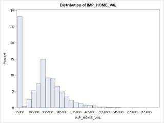
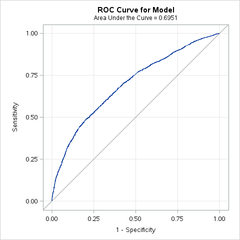
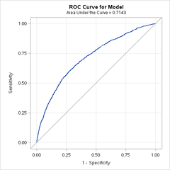
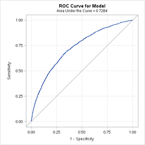

% Assignment 2: Insurance Logistics Regression
% Andrew G. Dunn^1^
% ^1^andrew.g.dunn@u.northwestern.edu

\vfill

**Andrew G. Dunn, Northwestern University Predictive Analytics Program**

Prepared for PREDICT-411: Generalized Linear Models.

Formatted using the \LaTeX\, references managed using pandoc-citeproc.

\newpage

# Background

This data set contains approximately 8100 recrods. Each record represents a
customer at an auto insurance company. Each record has two target variables. The
first, TARGET_FLAG indicates if the person was in a car crash. The second,
TARGET_AMT, will be zero if the person did not crash their vehicle, or be
greater than zero if there was a crash.

We will work towards building the components for a probability/severity model by
constructing a linear regression to estimate the probability that a person will
crash their car, and a model to estimate the cost in the event of a crash.

# Exploratory Data Analysis & Data Preparation

We will provide some background into the data after initial examination, then we
will:

- Obtain histograms for all continuous variables (seeking variability)
- Examine the bi-serial correlations for each continuous variable and the dependent variable (seeking higher correlation for better independent variable)
- Discretize each continuous variable with cut-points (seeking dichotomous relationship to dependent variable)
- Examine the cross tabulation of the discretized variables (seeking non-linear relationship to dependent variable)
    + If there is differences in the proportion profiles the originating variable will be incorporated into the model
    + May consider transformation of the originating variable
 - Obtain frequency counts for all categorical variables (seeking variability)
 - Obtain crosstabs of our dependent variable by each categorical variable (seeking proportional variation)
 - Code each categorical variable with dummy variables (seeking individual explanation over dependent variable)

Throughout these procedures we will be looking for variables that have a high
variability for inclusion in our model. We'll not include all of the diagnostics
graphics for sake of brevity in our writeup, however we will attempt to convey
the thorough nature of our exploration.

\newpage

## Data Background

We are provided a data dictionary which outlines the variables and provides an
estimate at the theoretical effect:

VARIABLE NAME  |  TYPE         |  DEFINITION
---------------|---------------|--------------------------------
AGE            |  continuous   |  Age of Driver
BLUEBOOK       |  continuous   |  Value of Vehicle
CAR_AGE        |  continuous   |  Vehicle Age
CAR_TYPE       |  categorical  |  Type of Car
CAR_USE        |  categorical  |  Vehicle Use
CLM_FREQ       |  continuous   |  #Claims(Past 5 Years)
EDUCATION      |  categorical  |  Max Education Level
HOMEKIDS       |  continuous   |  #Children @Home
HOME_VAL       |  continuous   |  Home Value
INCOME         |  continuous   |  Income
JOB            |  categorical  |  Job Category
KIDSDRIV       |  categorical  |  #Driving Children
MSTATUS        |  categorical  |  Marital Status
MVR_PTS        |  continuous   |  Motor Vehicle Record Points
OLDCLAIM       |  continuous   |  Total Claims(Past 5 Years)
PARENT1        |  categorical  |  Single Parent
RED_CAR        |  categorical  |  A Red Car
REVOKED        |  categorical  |  License Revoked (Past 7 Years)
SEX            |  categorical  |  Gender
TIF            |  continuous   |  Time in Force
TRAVTIME       |  continuous   |  Distance to Work
URBANICITY     |  categorical  |  Home/Work Area
YOJ            |  continuous   |  Years on Job

Table: Data Dictionary, with Data Types

We suspect that some of the variables that we initial think are going to be
continuous (due to their initial data type) may very well be categorical, such
as the number of children at home.

\newpage

VARIABLE NAME  |  THEORETICAL EFFECT
---------------|-------------------------------------------------------------------------------------------------
AGE            |  you and old people tend to be risky
BLUEBOOK       |  unknown effect on probability of collision but likely effect on payout if crash occurs
CAR_AGE        |  unknown effect on probability of collision but likely effect on payout if crash occurs
CAR_TYPE       |  unknown effect on probability of collision but likely effect on payout if crash occurs
CAR_USE        |  commercial vehicles are driven more so may have higher liklihood of collision
CLM_FREQ       |  the more claims filed in the past the more likely to file in the future
EDUCATION      |  unknown effect however more educated people likely drive more safely
HOMEKIDS       |  unknown effect
HOME_VAL       |  in theory home owners tend to drive more safely
INCOME         |  in theory wealthier people tend to get in fewer accidents
JOB            |  in theory white collar jobs tend to be safer
KIDSDRIV       |  teenagers driving the vehicle are more likely to get in crashes
MSTATUS        |  in theory married people tend to drive more safely
MVR_PTS        |  if you get more tickets you are likely to get in more crashes
OLDCLAIM       |  if you total payouts over the last period was high then your future payouts will likely be high
PARENT1        |  unknown effect
RED_CAR        |  urban legend is that red cars are more likely to be in accidents
REVOKED        |  if license was revoked then is likely to be a more risky driver
SEX            |  urban legend is that women have less crashes than men
TIF            |  long time customers are usually more safe
TRAVTIME       |  longer drives to work indicate longer exposure to risk
URBANICITY     |  unknown effect
YOJ            |  longer time spent in the workforce likely tend to drive more safely

Table: Data Dictionary, Theoretical Effects

These theoretical effects are good to have 'loaded into memory' as we begin
initial examination of the data set. We want to pay attention to variables
equally at the onset. However, if we're observing something such as low
correlation between our dependent variable and a variable that we think
theoretically should be indicative, we may consider what manipulations of the
variable are available to examine further.

\newpage

## Continuous Variables

First we will examine the continuous variable means with respect to the
dependent variable:

| Target | N Obs | Variable | N | Mean | Std Dev | N Missing |
---------|-------|----------|---|------|---------|------------
0 | 6008 | AGE      | 6007 | 45.3227901 | 8.2022705  | 1
0 | 6008 | BLUEBOOK | 6008 | 16230.95   | 8401.95    | 0
0 | 6008 | CAR_AGE  | 5640 | 8.6709220  | 5.7201267  | 368
0 | 6008 | CLM_FREQ | 6008 | 0.6486352  | 1.0860488  | 0
0 | 6008 | HOMEKIDS | 6008 | 0.6439747  | 1.0762090  | 0
0 | 6008 | HOME_VAL | 5665 | 169075.41  | 129938.83  | 343
0 | 6008 | INCOME   | 5673 | 65951.97   | 48552.20   | 335
0 | 6008 | MVR_PTS  | 6008 | 1.4137816  | 1.8916611  | 0
0 | 6008 | OLDCLAIM | 6008 | 3311.59    | 8143.61    | 0
0 | 6008 | TIF      | 6008 | 5.5557590  | 4.2020970  | 0
0 | 6008 | TRAVTIME | 6008 | 33.0303446 | 16.1312900 | 0
0 | 6008 | YOJ      | 5677 | 10.6718337 | 3.9175259  | 331
1 | 2153 | AGE      | 2148 | 43.3012104 | 9.5646287  | 5
1 | 2153 | BLUEBOOK | 2153 | 14255.90   | 8299.81    | 0
1 | 2153 | CAR_AGE  | 2001 | 7.3674789  | 5.5353874  | 142
1 | 2153 | CLM_FREQ | 2153 | 1.2169066  | 1.2483641  | 0
1 | 2153 | HOMEKIDS | 2153 | 0.9368323  | 1.1954470  | 0
1 | 2153 | HOME_VAL | 2032 | 115256.55  | 118150.14  | 121
1 | 2153 | INCOME   | 2043 | 50641.30   | 42782.04   | 110
1 | 2153 | MVR_PTS  | 2153 | 2.4816535  | 2.5791851  | 0
1 | 2153 | OLDCLAIM | 2153 | 6061.55    | 10071.09   | 0
1 | 2153 | TIF      | 2153 | 4.7807710  | 3.9329017  | 0
1 | 2153 | TRAVTIME | 2153 | 34.7681203 | 15.1853855 | 0
1 | 2153 | YOJ      | 2030 | 10.0167488 | 4.5122598  | 123

Table: Means with respect to the Dependent Variable (Target Flag)

From above we notice:

 - Several variables have missing records
 - There is human _noticeable_ difference in means between 0/1 target flag, however _noticeable_ differences are within the variable standard deviation.

We notice that of the missing records that none are exceedingly large
proportions of the observed data. We will take a blanket approach to imputation
where we use the mean. There may be deeper consequences in assigning the mean to
imputed values, however we feel that it is still better than removal of the
observations from the data set.

We further examine each variable by creating a histogram as well as tests for
normality. Some variables appear to resemble categorical variables, notably
CLM_FREQ, HOMEKIDS, MVR_PTS. When looking at these it seems reasonable to pull
them to the categorical side of the analysis, however they are much easier to
interpret if we continue to use them as continuous variables. We certainly
understand what a one unit increase is in each of these variables.

Within the histograms we notice three variables have very strong presence in the
left side of the histogram; IMP_CAR_AGE, IMP_HOME_VAL, and OLDCLAIM. For
IMP_CAR_AGE this seems logically reasonable due to survey construction
potentially binning the data request, there appears to be very little
information prior to one year of age. For IMP_HOME_VAL we suspect that the
fashion in which data is recorded is creating this significant left side
presence.

It's highly likely that if one doesn't own a home, then they report as $0, which
will naturally make for a confusing mean. We'd likely want to construct an
indicator variable for home ownership if this is the case.

The same goes for OLDCLAIM. There once again is a significant left presence that
likely indicates something about the method of data collection rather than the
phenomena that was being measured.

This is where we could conventionally explore interactions between these
variables while inquiring with our organization/customer for the methodology of
sampling, or domain specific nature of these collections. For example, we know
that if someone has a $1,000 deductible for their vehicle, it is unlikely they
would pay $1,000 to make a $1,000 claim. However, during the nature of _this_
study we realize the methodology of variable incorporation into the model, as
well as the interpretation is more important.

For each of these aforementioned variables (IMP_CAR_AGE, IMP_HOME_VAL, and
OLDCLAIM) we would consider a potential transformation of the data, but only if
we see promise for inclusion into the model.

We'll look at the simple correlation between the continuous variables and the
dependent variable:

| Variable  | Correlation |
------------|--------------
IMP_AGE     | -0.10313
BLUEBOOK    | -0.10338
IMP_CAR_AGE | -0.09734
IMP_HOME_VAL| -0.17848
IMP_INCOME  | -0.13824
OLDCLAIM    | 0.13808
TIF         | -0.08237
TRAVTIME    | 0.04815
IMP_YOJ     | -0.06849

Table: Continuous Variable Correlation to TARGET_FLAG

From this we see that there are some variables that we would automatically take
forward into model construction, notably anything that exceeds the 0.10
threshold. We are concerned to see that travel time is such a very low
correlation. We'd expect that the concept of exposure to operation of their
vehicle would significantly increase the likelihood of a crash. We will at this
time, to reduce the overall burden of the EDA and Data Preparation, choose to
abandon the use of TIF and YOJ.

As we've computed the cross correlation we can also notice some potential issues
we may have with variables in the future. We'll reserve observation until we
get to model construction and compute the variance inflation factor.

We'll examine correlation of the continuous variables to the dependent variable
in what is called a point bi-serial correlation. To do this we must first create
indicator variable families for each of the continuous variables. We will choose
to create these 'cut points' along the Q1 (25%), Mean and Q3 (75%) quantiles.
For some variables, such as IMP_HOME_VAL we will have to choose other quartiles
due to their being skewed in one direction.

In examining the point bi-serial correlations we are looking at the proportion
profiles. For each continuous variable we have broken into four cut-points.
Without laboriously re-creating the tables we observe and conclude that we have
different proportion profiles in every single continuous variable. Furthermore
we see a change in proportion profile across our cut-points, which would
indicate that we have a non-linear relationship between our dependent variable
and these continuous variables. This likely indicates that we should peform some
kind of transformation to the variable during model incorporation. We'll
experiment with this at model construction time. Of the continuous variables,
the most wary we are in using is IMP_HOME_VAL by itself. We will at this time
create an indicator variable called I_HOMEOWN that will be 0 if IMP_HOME_VAL is
0, and 1 if otherwise. In doing so we notice that about 28% of our observatons,
to include the missing values that have been imputed, are not home owners.

## Categorical Variables

We will initially look at the bi-serial correlation and look at the proportion
profiles. Once again, without laboriously re-creating the tables for each, we
will comment on our observations. We're happy that someone pre-processed this
data set and created variables with the z_* prefix, it makes it easier for us to
consider the categorical variable such as MSTATUS because we can look at both
married and unmarried. Every single categorical variable has differing
proportion profiles across their span except for URBANICITY. For sake of
reducing our overall workload we'll remove this variable from further analysis
based on these criteria. We also notice that it was likely not a great move to
shift MVR_PTS to a categorical variable, given that is has 13 bins we will
likely model this as a continuous variable. We'll actually reverse o

We will now code each categorical variable as a family of dummy variables. In
this we will choose our variable of reference, as to avoid the dummy variable
trap, as the smallest category in each variable. The only exception to this will
be when we code the 'Yes'/'No' variables, in which we will always code the dummy
variable to be 1 when Yes as to stick with all sane conventions of programming.

We will be doing these by hand despite awareness of the class statement with SAS
proc logistic. Primarily to show that we understand the concept of withholding a
variable to prevent falling into the trap.

# Model Construction (Logistics, Probability of Crash)

We're going to use a logistics regression model and the default scoring method
(Fisher), which is the equivalent to fitting by iteratively reweighted least
squares. This method results in a large grid of the Chi-Square score for each
model, incrementing by the number of incorporated variables. Below we'll examine
the best scoring for the two top models with a single variable through seven
variables.

N Variables | Chi-Square Score | Incorporated Variables
---|-------------|-------------------------------------------------------------
1  |  360.5259   |  MVR_PTS
1  |  349.4074   |  CLM_FREQ
2  |  508.7027   |  CLM_FREQ MVR_PTS
2  |  504.413    |  MVR_PTS REV_L
3  |  641.5337   |  CLM_FREQ MVR_PTS REV_L
3  |  639.9598   |  MVR_PTS USE_P REV_L
4  |  775.7635   |  IMP_INCOME MVR_PTS USE_P REV_L
4  |  763.1352   |  CLM_FREQ IMP_INCOME USE_P REV_L
5  |  888.9681   |  CLM_FREQ IMP_INCOME MVR_PTS USE_P REV_L
5  |  880.2277   |  IMP_INCOME MVR_PTS USE_P MARRIED_Y REV_L
6  |  983.9883   |  CLM_FREQ IMP_INCOME MVR_PTS USE_P MARRIED_Y REV_L
6  |  968.6079   |  CLM_FREQ IMP_INCOME MVR_PTS I_HOMEOWN USE_P REV_L
7  |  1044.1525  |  CLM_FREQ IMP_INCOME MVR_PTS TYPE_MINI USE_P MARRIED_Y REV_L
7  |  1028.586   |  CLM_FREQ IMP_INCOME MVR_PTS I_HOMEOWN TYPE_MINI USE_P REV_L

Table: Logistics Regression by Fisher Score

Given we are only attempting to use a single selection criteria, where in
practice we would attempt to examine many more, we are blissfully happy with the
models produced. We were terribly worried about exceedingly tedious to interpret
models being selected for us, in this case we're comfortable taking models of
four, five, and six variables in size. We will construct and interpret the top
performing models with these number of variables. We choose to begin at four
variables due to the increase in Chi-Square score as more models are included.
We also choose to end before seven variables because we would have to include
the use of each TYPE_* for every vehicle in the data set. Although its not
difficult to interpret the influence of an dummy/indicator variable, we prefer
the easier-to-explain model for brevity sake.

We notice that IMP_INCOME is incorporated into each of our models and when we
originally examined it with a histogram we saw that it was heavily left of
center. It did pass all tests for normality, however before deciding to use
IMP_INCOME in our models we created a log transformation and noticed that in
each of our models the overall performance (ROC, Concordant, Discordant) went
down. Therefor we chose to continue using the IMP_INCOME even though we
recognize it isn't ideally normal in its histogram form.

\newpage

# Model Selection (Logistics, Probability of Crash)

We will provide details for three selected models and interpret the results.

$$Logit(Y) = \beta_0 + \beta_1X_1 + \beta_2X_2 + \beta_2X_2 + \beta_3X_3 + \beta_4X_4 + \epsilon$$

Where:

| In Model | In Data     | Label |
|:---------|:------------|--------
$Y$ is     | TARGET_FLAG | Crashes
$X_1$ is   | IMP_INCOME  | Imputed Income
$X_2$ is   | MVR_PTS     | Motor Vehicle Record Points
$X_3$ is   | USE_P       | Vehicle Use (Personal/Commercial)
$X_4$ is   | REV_L       | Licensed Revoked

Table: Four Variable Model

| Coefficent | Value | $(e^{\beta}-1)$ |Wald Chi-Square | $\text{Pr} > |t|$ |
|:-----------|:-----:|:---------------:|:--------------:|:-----------------:|
| Intercept  | -0.6500  | -0.478     | 108.6164 | < 0.0001 |
| IMP_INCOME | -0.0000082| -0.0000082 | 155.0936 | < 0.0001 |
| MVR_PTS    | 0.2013    | 0.223 | 295.9227 | < 0.0001 |
| USE_P      | -0.6941   | -0.50 | 165.2281 | < 0.0001 |
| REV_L      | 0.9122    | 1.489 | 155.2338 | < 0.0001 |

Table: Four Variable Model Coefficient Values

The interpretation of the above model, all variables being held, is that: For a
one unit increase in income there will be a 0.0008% decrease in the likelihood
of a crash. For a one unit increase in the amount of motor vehicle record points
there is a 22.3% increase in the likelihood of a crash. If one is using a
personal vehicle there is a 50% decrease in the likelihood of a crash. Finally,
if the driver has had a license revoked in the past there is a 148% increase in
the likelihood of a crash.

We examine the ROC and see that we have a model performing at 0.6951 coverage.
We notice that we're above the diagonal, and as such are generally happy. We
attempt to compute the KS statistic by doing a random sampling for test and
validation and using the SAS npar1way procedure, however the output is
convoluted enough that we don't understand it. The documentation for npar1way
and methods for computing the KS statistic on Logistic models within SAS is
lacking. If this were a task within an organization we'd seek assistance from
other experience modelers, or simply used a less cryptic statistical package.

We generally don't love the interpret-ability of the IMP_INCOME variable
parameters, however scaling after parameter estimate isn't acceptable and
scaling before parameter estimate requires us to speak in terms of the scaling
factor estimate (in this case if we used 10000 as a scaling factor it would be
for every 7% decrease, or 700$ decrease). It seems unreasonable, or illogical to
make this claim.

\newpage

$$Logit(Y) = \beta_0 + \beta_1X_1 + \beta_2X_2 + \beta_2X_2 + \beta_3X_3 + \beta_4X_4 + \beta_5X_5 + \epsilon$$

| In Model | In Data     | Label |
|:---------|:------------|--------
$Y$ is     | TARGET_FLAG | Crashes
$X_1$ is   | CLM_FREQ    | #Claims(Past 5 Years)
$X_2$ is   | IMP_INCOME  | Imputed Income
$X_3$ is   | MVR_PTS     | Motor Vehicle Record Points
$X_4$ is   | USE_P       | Vehicle Use (Personal/Commercial)
$X_5$ is   | REV_L       | Licensed Revoked

Table: Five Variable Model

| Coefficent | Value | ($e^{\beta}-1$) |Wald Chi-Square | $\text{Pr} > |t|$ |
|:-----------|:-----:|:---------------:|:--------------:|:-----------------:|
| Intercept  | -0.8074    | -0.554     | 156.3133 | < 0.0001 |
| CLM_FREQ   | 0.2709     | 0.312      | 135.2113 | < 0.0001 |
| IMP_INCOME | -0.00000819| -0.00000819| 151.5979 | < 0.0001 |
| MVR_PTS    | 0.1463     | 0.158 | 135.3884 | < 0.0001 |
| USE_P      | -0.6694    | -0.488 | 150.7663 | < 0.0001 |
| REV_L      | 0.8967     | 1.451 | 147.2318 | < 0.0001 |

Table: Five Variable Model Coefficient Values

For a one unit increase in the claim frequency (another claim within the last
five year period) the likelihood of a crash increases by 31.2%. For a one unit
increase in income the likelihood of a crash decreases by 0.0008%. For a one
unit increase in motor vehicle record points the likelihood of a crash increases
by 15.8%. Use of a personal vehicle results in a 48% less likelihood of a crash
as opposed to a commercial vehicle. Finally, if the driver has their licensed
revoked in the past there is a 145% increase in likelihood of a crash.

We see an increase from 0.6951 to 0.7143 with the inclusion of CLM_FREQ into our
model.

\newpage

$$Logit(Y) = \beta_0 + \beta_1X_1 + \beta_2X_2 + \beta_2X_2 + \beta_3X_3 + \beta_4X_4 + \beta_5X_5 + \beta_6X_6 + \epsilon$$

| In Model | In Data     | Label |
|:---------|:------------|--------
$Y$ is     | TARGET_FLAG | Crashes
$X_1$ is   | CLM_FREQ    | #Claims(Past 5 Years)
$X_2$ is   | IMP_INCOME  | Imputed Income
$X_3$ is   | MVR_PTS     | Motor Vehicle Record Points
$X_4$ is   | USE_P       | Vehicle Use (Personal/Commercial)
$X_5$ is   | MARRIED_Y   | Marital Status (Yes Married)
$X_6$ is   | REV_L       | Licensed Revoked

Table: Six Variable Model

| Coefficent | Value | ($e^{\beta}-1$) |Wald Chi-Square | $\text{Pr} > |t|$ |
|:-----------|:-----:|:---------------:|:--------------:|:-----------------:|
| Intercept  | -0.4333    | -0.352 | 35.5139 | < 0.0001 |
| CLM_FREQ   | 0.2631     | 0.301      | 124.9811 | < 0.0001 |
| IMP_INCOME | -0.00000856| -0.00000856| 162.8418 | < 0.0001 |
| MVR_PTS    | 0.1449     | 0.156 | 130.5962 | < 0.0001 |
| USE_P      | -0.6733    | -0.489 | 149.9436 | < 0.0001 |
| MARRIED_Y  | -0.5995    | -0.45 | 121.8612 | < 0.0001 |
| REV_L      | 0.8764     | 1.402 | 138.1145 | < 0.0001 |

Table: Six Variable Model Coefficient Values

For a one unit increase in the claim frequency (another claim within the last
five year period) the likelihood of a crash increases by 30.1%. For a one unit
increase in income the likelihood of a crash decreases by 0.0008%. For a one
unit increase in motor vehicle record points the likelihood of a crash increases
by 15.6%. Use of a personal vehicle results in a 49% less likelihood of a crash
as opposed to a commercial vehicle. Being married results in a 45% less
likelihood of a crash. Finally, if the driver has their licensed
revoked in the past there is a 140% increase in likelihood of a crash.

This model, with six variables, provides us with our highest ROC coverage at
0.7284.

For each of these models we saw an increase in ROC coverage with the increase of
an independent variable. We feel that each of the included independent variables
are simple to explain in their interpretation, so we don't feel unnecessary
pressure in having them included in the select model. For our model deployment
we will use the six variable model to predict the likelihood of a crash.

In the case of the six variable model, we are incorporating a variable that we
imputed with the mean. When we did this we created an indicator variable for the
observations that we imputed. We incorporated that into a seven variable model
to examine whether the ROC curve improved, when we saw that it did not we
decided to stick with the six variable model for reduced complexity during
deployment and interpretation.

# Model Construction (Linear Regression, Estimation of Cost)

For this step of our analysis we will utilize a logistics regression and will
have our selection criteria be based on the Adjusted R-Square metric. We
manually cull down the models to a smaller amount of parameters primarily in
support of interpret-ability. Our ultimate selection is a model such that:

$$Y = \beta_0 + \beta_1X_1 + \beta_2X_2 + \beta_2X_2 + \beta_3X_3 $$

| In Model | In Data     | Label |
|:---------|:------------|--------
$Y$ is     | TARGET_AMT  | Cost after Crash
$X_1$ is   | HOMEKIDS    | Value of Vehicle
$X_2$ is   | IMP_CAR_AGE | Vehicle Age
$X_3$ is   | CLM_FREQ    | #Claims(Past 5 Years)

Table: Three Variable model for TARGET_AMT

| Coefficent | Value | t-Value | $\text{Pr} > |t|$ |
|:-----------|:-----:|:--------------:|:----------:|
| Intercept  | 1324.64489 | 12.10 | < 0.0001 |
| HOMEKIDS   | 216.66500  | 4.64  | < 0.0001 |
| IMP_CAR_AGE| -41.75664  | -4.42 | < 0.0001 |
| CLM_FREQ   | 464.81029  | 10.44 | < 0.0001 |

Table: Three Variable Model Coefficient Values

For this if all variables are held equal, the intercept provides us with an
indication of the target amount crash cost. For every one unit increase in the
the number of kids at home, the cost increases by approximately $217 on average.
For every year older the vehicle is that is in the crash the cost decreases by
approximately $42 on average. For every one unit increase in the number of
claims filed over the last five years, the cost increases approximately $465 on
average.

The model above isn't likely the best model that can be found with the variables
within this data set:

| Source | |
|:-:|:-:|
| Root MSE | 4659.18377 |
| R-Square | 0.0193 |
| Adj R-Square | 0.0190 |
| F Value | 53.61 |

Table: Thee Variable Model Goodness-of-Fit

We generated several models using automatic variable selection across all of our
prepared variables. The models that scored highest with goodness-of-fit
selection criteria tended to incorporate more than 15 variables (when
considering dummy variables). We've chosen, despite the poor performance, to
choose a much simpler model for implementation in our deployment phase.

# Conclusion

The construction of Logistics models requires quite a lot of preparatory data
manipulation. Within our data set we were given variables that had already been
prepared slightly to assist in this process, however there was still a lot of
iterative work to examine variables that would be acceptable to take forward
into the model. In the case of using variation in ratio we saw that almost every
single variable qualified to be taken forward. As time goes on and we continue
to utilize this modeling methodology it will be interesting to examine how early
observation of variation in ratio will be indicative of need for incorporation
into the model, and likely more importantly how the variable needs to be
transformed.

We didn't explore exhaustive transformation of variables that were incorporated
into our model and it likely will impact the overall performance of the models
constructed. Some of the variables we transformed early on due to examination of
their nature (via histograms) didn't perform any better after transformation.

We were surprised to see few of the dummy variable families get selected during
our automated variable selection techniques. In this analysis when these
variables didn't rear their head for immediate model incorporation it was viewed
as acceptable due to their increase of the interpretation. The group membership
dummy variables seemed to be more popular during selection, as well as provided
a simpler form for interpretation.

The logistics model is more naturally interpret-able than previous models we've
constructed with the OLS method.

\newpage

# Appendix: SAS Code, Analysis

~~~{.sh}
libname four11 '/scs/wtm926/' access=readonly;

Data eda;
  set four11.logit_insurance;

proc contents data=eda;

/* Continous */

proc means data=eda n nmiss mean std range P5 P95;
    var AGE BLUEBOOK CAR_AGE CLM_FREQ HOMEKIDS HOME_VAL INCOME MVR_PTS OLDCLAIM TIF TRAVTIME YOJ;
    class TARGET_FLAG;

proc means data=eda n nmiss mean std range P5 P95;
    var AGE BLUEBOOK CAR_AGE CLM_FREQ HOMEKIDS HOME_VAL INCOME MVR_PTS OLDCLAIM TIF TRAVTIME YOJ;

data imp_eda;
    set eda;

    IMP_AGE = AGE;
    I_IMP_AGE = 0;
    if missing(IMP_AGE) then do;
        IMP_AGE = 44.7903127;
        I_IMP_AGE = 1;
    end;

    IMP_CAR_AGE = CAR_AGE;
    I_IMP_CAR_AGE = 0;
    if missing(IMP_CAR_AGE) then do;
        IMP_CAR_AGE = 8.3283231;
        I_IMP_CAR_AGE = 1;
    end;

    IMP_HOME_VAL = HOME_VAL;
    I_IMP_HOME_VAL = 0;
    if missing(IMP_HOME_VAL) then do;
        IMP_HOME_VAL = 154867.29;
        I_IMP_HOME_VAL = 1;
    end;

    IMP_INCOME = INCOME;
    I_IMP_INCOME = 0;
    if missing(IMP_INCOME) then do;
        IMP_INCOME = 61898.10;
        I_IMP_INCOME = 1;
    end;
    log_IMP_INCOME = log(IMP_INCOME);
    t_IMP_INCOME = IMP_INCOME / 10000;

    IMP_YOJ = YOJ;
    I_IMP_YOJ = 0;
    if missing(IMP_YOJ) then do;
        IMP_YOJ = 10.4992864;
        I_IMP_YOJ = 1;
    end;

    if IMP_HOME_VAL = 0 then I_HOMEOWN = 0;
        else I_HOMEOWN = 1;

proc freq data=imp_eda;
    table I_HOMEOWN;

proc corr data=imp_eda;
    var TARGET_FLAG IMP_AGE BLUEBOOK IMP_CAR_AGE CLM_FREQ HOMEKIDS IMP_HOME_VAL IMP_INCOME MVR_PTS OLDCLAIM TIF TRAVTIME IMP_YOJ;

proc univariate data=imp_eda normal;
    var IMP_AGE BLUEBOOK IMP_CAR_AGE CLM_FREQ HOMEKIDS IMP_HOME_VAL IMP_INCOME MVR_PTS OLDCLAIM TRAVTIME;
    histogram;

data cut_imp_eda;
    set imp_eda;

    if IMP_AGE < 39 then IMP_AGE_DISCRETE = 1; *25th;
        else if IMP_AGE < 45 then IMP_AGE_DISCRETE = 2; *50th;
        else if IMP_AGE < 51 then IMP_AGE_DISCRETE = 3; *75th;
        else IMP_AGE_DISCRETE = 4;

    if BLUEBOOK < 9280 then BLUEBOOK_DISCRETE = 1; *25th;
        else if BLUEBOOK < 14440 then BLUEBOOK_DISCRETE = 2; *50th;
        else if BLUEBOOK < 20850 then BLUEBOOK_DISCRETE = 3; *75th;
        else BLUEBOOK_DISCRETE = 4;

    if IMP_CAR_AGE < 4.00000 then IMP_CAR_AGE_DISCRETE = 1; *25th;
        else if IMP_CAR_AGE < 8.32832 then IMP_CAR_AGE_DISCRETE = 2; *50th;
        else if IMP_CAR_AGE < 12.00000 then IMP_CAR_AGE_DISCRETE = 3; *75th;
        else IMP_CAR_AGE_DISCRETE = 4;

    if IMP_HOME_VAL < 154867 then IMP_HOME_VAL_DISCRETE = 1; *50th;
        else if IMP_HOME_VAL < 233352 then IMP_HOME_VAL_DISCRETE = 2; *75th;
        else if IMP_HOME_VAL < 311195 then IMP_HOME_VAL_DISCRETE = 3; *90th;
        else IMP_HOME_VAL_DISCRETE = 4;

    if IMP_INCOME < 29706.76 then IMP_INCOME_DISCRETE = 1; *25th;
        else if IMP_INCOME < 57386.58 then IMP_INCOME_DISCRETE = 2; *50th;
        else if IMP_INCOME < 83303.72 then IMP_INCOME_DISCRETE = 3; *75th;
        else IMP_INCOME_DISCRETE = 4;

    if OLDCLAIM < 4636 then OLDCLAIM_DISCRETE = 1; *75th;
        else if OLDCLAIM < 9583 then OLDCLAIM_DISCRETE = 2; *90th;
        else if OLDCLAIM < 27090 then OLDCLAIM_DISCRETE = 3; *95th;
        else OLDCLAIM_DISCRETE = 4;

    if TRAVTIME < 22.45170 then TRAVTIME_DISCRETE = 1; *25th;
        else if TRAVTIME < 32.87097 then TRAVTIME_DISCRETE = 2; *50th;
        else if TRAVTIME < 43.80707 then TRAVTIME_DISCRETE = 3; *75th;
        else TRAVTIME_DISCRETE = 4;

proc freq data=cut_imp_eda;
    table TARGET_FLAG*IMP_AGE_DISCRETE;
proc freq data=cut_imp_eda;
    table TARGET_FLAG*BLUEBOOK_DISCRETE;
proc freq data=cut_imp_eda;
    table TARGET_FLAG*IMP_CAR_AGE_DISCRETE;
proc freq data=cut_imp_eda;
    table TARGET_FLAG*IMP_HOME_VAL_DISCRETE;
proc freq data=cut_imp_eda;
    table TARGET_FLAG*IMP_INCOME_DISCRETE;
proc freq data=cut_imp_eda;
    table TARGET_FLAG*OLDCLAIM_DISCRETE;
proc freq data=cut_imp_eda;
    table TARGET_FLAG*TRAVTIME_DISCRETE;

/* Categorical */

proc freq data=imp_eda;
    tables CAR_TYPE CAR_USE EDUCATION JOB KIDSDRIV MSTATUS PARENT1 RED_CAR REVOKED SEX URBANICITY;

proc freq data=imp_eda;
    table TARGET_FLAG*CAR_TYPE;
proc freq data=imp_eda;
    table TARGET_FLAG*CAR_USE;
proc freq data=imp_eda;
    table TARGET_FLAG*CLM_FREQ;
proc freq data=imp_eda;
    table TARGET_FLAG*EDUCATION;
proc freq data=imp_eda;
    table TARGET_FLAG*HOMEKIDS;
proc freq data=imp_eda;
    table TARGET_FLAG*JOB;
proc freq data=imp_eda;
    table TARGET_FLAG*KIDSDRIV;
proc freq data=imp_eda;
    table TARGET_FLAG*MSTATUS;
proc freq data=imp_eda;
    table TARGET_FLAG*MVR_PTS;
proc freq data=imp_eda;
    table TARGET_FLAG*PARENT1;
proc freq data=imp_eda;
    table TARGET_FLAG*RED_CAR;
proc freq data=imp_eda;
    table TARGET_FLAG*REVOKED;
proc freq data=imp_eda;
    table TARGET_FLAG*SEX;
proc freq data=imp_eda;
    table TARGET_FLAG*URBANICITY;

data imp_d_eda;
    set imp_eda;

    * Variable of reference: Panel Truck;
    if CAR_TYPE in ('Minivan' 'Panel Truck' 'Pickup' 'Sports Car' 'Van' 'z_SUV') then do;
        TYPE_MINI = (CAR_TYPE eq 'Minivan');
        TYPE_PICK = (CAR_TYPE eq 'Pickup');
        TYPE_SPOR = (CAR_TYPE eq 'Sports Car');
        TYPE_VAN = (CAR_TYPE eq 'Van');
        TYPE_SUV = (CAR_TYPE eq 'z_SUV');
    end;

    * Variable of reference: Commercial;
    if CAR_USE in ('Commercial' 'Private') then do;
        USE_P = (car_use eq 'Private');
    end;

    * Variable of reference: PhD;
    if EDUCATION in ('<High School' 'Bachelors' 'Masters' 'PhD' 'z_High School') then do;
        EDU_HS = (EDUCATION eq '<High School');
        EDU_BA = (EDUCATION eq 'Bachelors');
        EDU_MA = (EDUCATION eq 'Masters');
        EDU_ZHS = (EDUCATION eq 'z_High School');
    end;

    * Variable of reference: Doctor;
    if JOB in ('Clerical' 'Home Maker' 'Lawyer' 'Manager' 'Professional' 'Student' 'z_Blue Collar') then do;
        JOB_C = (JOB eq 'Clerical');
        JOB_HM = (JOB eq 'Home Maker');
        JOB_L = (JOB eq 'Lawyer');
        JOB_M = (JOB eq 'Manager');
        JOB_P = (JOB eq 'Professional');
        JOB_S = (JOB eq 'Student');
        JOB_BC = (JOB eq 'z_Blue Collar');
    end;

    if MSTATUS in ('Yes' 'z_No') then do;
        MARRIED_Y = (MSTATUS eq 'Yes');
    end;

    if PARENT1 in ('No' 'Yes') then do;
        PARTENT_S = (PARENT1 eq 'YES');
    end;

    if RED_CAR in ('no' 'yes') then do;
        RED_C = (RED_CAR eq 'yes');
    end;

    if REVOKED in ('No' 'Yes') then do;
        REV_L = (REVOKED eq 'Yes');
    end;

    * Variable of reference: Male;
    if SEX in ('M' 'z_F') then do;
        SEX_F = (SEX eq 'z_F');
    end;

/* Modeling TARGET_FLAG */

proc logistic data=imp_d_eda descending plots(only)=roc(id=prob);
    model TARGET_FLAG = IMP_AGE BLUEBOOK IMP_CAR_AGE CLM_FREQ HOMEKIDS IMP_INCOME MVR_PTS OLDCLAIM TRAVTIME
                        I_HOMEOWN
                        TYPE_MINI TYPE_PICK TYPE_SPOR TYPE_VAN TYPE_SUV USE_P EDU_HS EDU_BA EDU_MA EDU_ZHS
                        JOB_C JOB_HM JOB_L JOB_M JOB_P JOB_S JOB_BC MARRIED_Y PARTENT_S RED_C REV_L SEX_F /
                        selection=score outroc=roc_model rsq lackfit;
    output out=model_data pred=yhat_model;

proc logistic data=imp_d_eda DESCENDING PLOTS=EFFECT PLOTS=ROC;
    model TARGET_FLAG = IMP_INCOME MVR_PTS USE_P REV_L / rsq lackfit;
    output out=model_4_data pred=model_4_yhat;

proc logistic data=imp_d_eda DESCENDING PLOTS=EFFECT PLOTS=ROC;
    model TARGET_FLAG = CLM_FREQ IMP_INCOME MVR_PTS USE_P REV_L / rsq lackfit;
    output out=model_5_data pred=model_5_yhat;

proc logistic data=imp_d_eda DESCENDING PLOTS=EFFECT PLOTS=ROC;
    model TARGET_FLAG = CLM_FREQ IMP_INCOME MVR_PTS USE_P MARRIED_Y REV_L / rsq lackfit;
    output out=model_6_data pred=model_6_yhat;

proc logistic data=imp_d_eda DESCENDING PLOTS=EFFECT PLOTS=ROC;
    model TARGET_FLAG = CLM_FREQ IMP_INCOME I_IMP_INCOME MVR_PTS USE_P MARRIED_Y REV_L / rsq lackfit;
    output out=model_6_data pred=model_6_yhat;

/* Modeling TARGET_AMT */

proc reg data=imp_d_eda;
    model TARGET_AMT = IMP_AGE BLUEBOOK IMP_CAR_AGE CLM_FREQ HOMEKIDS IMP_INCOME MVR_PTS OLDCLAIM TRAVTIME I_HOMEOWN TYPE_MINI TYPE_PICK TYPE_SPOR TYPE_VAN TYPE_SUV USE_P EDU_HS EDU_BA EDU_MA EDU_ZHS JOB_C JOB_HM JOB_L JOB_M JOB_P JOB_S JOB_BC MARRIED_Y PARTENT_S RED_C REV_L SEX_F /
    selection=adjrsq aic bic cp best=5;

proc reg data=imp_d_eda;
    model TARGET_AMT = HOMEKIDS IMP_CAR_AGE CLM_FREQ;

run;
~~~

\newpage

# Appendix: SAS Code, Deployment

~~~{.sh}
libname four11 '/scs/wtm926/' access=readonly;

data testing;
    set four11.logit_insurance_test;

data testing_fixed;
    set testing;

    IMP_CAR_AGE = CAR_AGE;
    I_IMP_CAR_AGE = 0;
    if missing(IMP_CAR_AGE) then do;
        IMP_CAR_AGE = 8.3283231;
        I_IMP_CAR_AGE = 1;
    end;

    IMP_INCOME = INCOME;
    I_IMP_INCOME = 0;
    if missing(IMP_INCOME) then do;
        IMP_INCOME = 61898.10;
        I_IMP_INCOME = 1;
    end;

    if CAR_USE in ('Commercial' 'Private') then do;
        USE_P = (car_use eq 'Private');
    end;
    if MSTATUS in ('Yes' 'z_No') then do;
        MARRIED_Y = (MSTATUS eq 'Yes');
    end;
    if REVOKED in ('No' 'Yes') then do;
        REV_L = (REVOKED eq 'Yes');
    end;

data testing_score;
    set testing_fixed;

    wat = 0.2631 * CLM_FREQ - 0.00000856 * IMP_INCOME + 0.1449 * MVR_PTS - 0.6733 * USE_P - 0.5995 * MARRIED_Y + 0.8764 * REV_L - 0.4333;
/*  pi = exp(wat) / (1+exp(wat)); */
/*  P_TARGET_FLAG = (pi gt 0.50); */
    P_TARGET_FLAG = exp(wat) / (1+exp(wat));
    P_TARGET_AMT = 1324.64489 + 216.66500 * HOMEKIDS - 41.75664 * IMP_CAR_AGE + 464.81029 * CLM_FREQ;
    keep index P_TARGET_FLAG P_TARGET_AMT;

proc print data=testing_score;

proc export data=testing_score
    outfile='/sscc/home/a/agd808/sasuser.v94/411/2/out.csv'
    dbms=csv
    replace;

run;
~~~