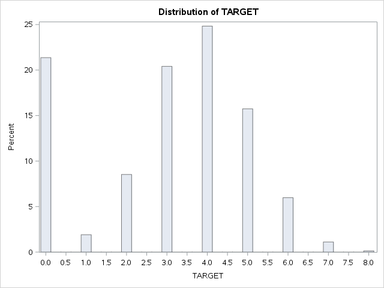

% Assignment 3: Wine Sales Poisson Regression
% Andrew G. Dunn^1^
% ^1^andrew.g.dunn@u.northwestern.edu

\vfill

**Andrew G. Dunn, Northwestern University Predictive Analytics Program**

Prepared for PREDICT-411: Generalized Linear Models.

Formatted using the \LaTeX\, references managed using pandoc-citeproc.

\newpage

# Background

This data set contains information on approximately 12,000 commercially
available wines. The variables are mostly related to the chemical properties,
with others relating to qualitative ratings by individuals. The target variable
is the number of sample cases of wine that were purchased by wine distribution
companies after sampling. A large wine manufacture is studying the data in order
to predict the number of wine cases ordered based upon the wine characteristics.
If it is possible to predict the number of cases, the manufacture will be able
to adjust their wine offerings with the goal to maximize sales.

We will work towards building Poisson and Negative Binomial models that will
predict the target number of cases ordered for each wine.

# Exploratory Data Analysis & Data Preparation

We will provide some background into the data after initial examination, then we
will:

 - Obtain histogram and statistical description for target variable
     + examine mean and variance to check assumption of equality for Poisson or Negative Binomial distribution
     + examine histogram for indication of zero inflation
 - Obtain histograms for all continuous variables
     + examine the distributions with transformation in mind during modeling
 - Obtain frequency counts for all categorical variables (seeking variability)

Variable            |  Description
--------------------|---------------------------------------------------------------------------------
AcidIndex           |  Proprietary method of testing total acidity of wine by using a weighted average
Alcohol             |  Alcohol Content
Chlorides           |  Chloride content of wine
CitricAcid          |  Citric Acid Content
Density             |  Density of Wine
FixedAcidity        |  Fixed Acidity of Wine
FreeSulfurDioxide   |  Sulfur Dioxide content of wine
LabelAppeal         |  Marketing Score indicating the appeal of label design for consumers.
ResidualSugar       |  Residual Sugar of wine
STARS               |  Wine rating by a team of experts. 4 Stars = Excellent, 1 Star = Poor
Sulphates           |  Sulfate conten of wine
TotalSulfurDioxide  |  Total Sulfur Dioxide of Wine
VolatileAcidity     |  Volatile Acid content of wine
pH                  |  pH of wine

Table: Data Dictionary

We're thinking at first that we will model _labelappeal_ and _stars_ as
categorical variables. We will first consider the mean and variance of the
target variable:

Mean      | Variance
----------|----------
3.0290739 | 3.7108945

Table: Mean and Variance of the target variable

From this we see that we would be in violation of the assumption that mean and
variance are equal for the Poisson distribution, however we'd not be in
violation for the Negative Binomial distribution which requires the variance to
be larger than the mean.

We further examine the histogram of the target variable and notice that it
passes tests of normality, but shows obvious signs of being zero inflated. Even
though at this stage we would likely restrict our modeling approach based on
this observation, we plan to use normal OLS regression, Poisson, and Negative
Binomial to examine the performance differences.

\newpage

We then want to examine the variable presence:

Variable            |  N      |  N Missing
--------------------|---------|-----------
AcidIndex           |  12795  |  0
Alcohol             |  12142  |  653
Chlorides           |  12157  |  638
CitricAcid          |  12795  |  0
Density             |  12795  |  0
FixedAcidity        |  12795  |  0
FreeSulfurDioxide   |  12148  |  647
LabelAppeal         |  12795  |  0
ResidualSugar       |  12179  |  616
STARS               |  9436   |  3359
Sulphates           |  11585  |  1210
TotalSulfurDioxide  |  12113  |  682
VolatileAcidity     |  12795  |  0
pH                  |  12400  |  395

Table: Variables and Missing Counts

We notice that many variables have missing observations within the data set. We
will impute these variables with the mean value (in th case of categorical, we
will round) and create an indicator for when the data was missing. In this case,
with so many, if we find that we want to carry a variable forward into the
model, we will be sure to use the missing indicator variable along with it.

Initially looking at the data set we were happy that there was at-least one
variable that was going ot be an obvious indication of how much the wine was
liked (stars), but now we see that there is many missing values for this
variable. Due to this we will be interested in the correlation and frequency
values for the indicator of imputation for stars.

We examine means statistics for each variable by the count of the target
variable and notice there appears to be differences between many variables as we
move from zero to eight cases purchased. Not a single variable is sticking out
as something that we might not want to use other than the 25% missing
observations in stars. We won't eliminate stars because it seems logically like
the most valuable variable for indicating desire for purchase.

We examine the two categorical variables (labelappeal, stars) frequency tables
given the target variable and notice proportional variation throughout the
range.

We examine the histogram of each variable and notice the following:

 - each variable passes all tests for normality at the significant level
 - many variables have significant center spikes
 - stars, after imputation, is left centered

We speculate that the center spike in each of the continuous variables might be
cause for a log scaling of the variables. We at this time won't begin scaling
because we know it adds complexity to the model interpretation.

\newpage

We examine the simple Pearson correlation between our imputed variables:

Variable                |  Correlation  | $\text{Pr} > |r| \text{ under } H_0: \rho = 0$
------------------------|---------------|---------------------------------------------
acidindex               |  -0.24605     | < 0.0001
imp_alcohol             |  0.06043      | < 0.0001
imp_chlorides           |  -0.03724     | < 0.0001
citricacid              |  0.00868      | 0.3260
density                 |  -0.03552     | < 0.0001
fixedacidity            |  -0.04901     | < 0.0001
imp_freesulfurdioxide   |  0.04269      | < 0.0001
labelappeal             |  0.35650      | < 0.0001
imp_residualsugar       |  0.01607      | 0.0691
imp_stars               |  0.40013      | < 0.0001
i_imp_stars             | -0.57158      | < 0.0001
imp_sulphates           |  -0.03691     | < 0.0001
imp_totalsulfurdioxide  |  0.05010      | < 0.0001
volatileacidity         |  -0.08879     | < 0.0001
imp_ph                  |  -0.00928     | 0.2939

Table: Variable Correlation with Target

From this point we're feeling the need to throw out any variable that doesn't
have at least an $|0.1|$ level of correlation, without transformation, with our
dependent variable. We do see high correlation between the qualitative review
variables, _labelappeal_ and _stars_, and the dependent variable. Interestingly
our highest correlation is with the indicator of imputation for imp_stars. Of
the variables above, we're going to continue detailed examination into the
modeling stage of all those that are significant and above the $|0.1|$
threshold. This leaves us with acidindex, labelappeal, imp_stars, and
i_imp_stars.

It's quite interesting to be down to one physical measure and two qualitative
measures. We're going to try to build the best model we can based on our
abilities, however in the conclusion section we will remark on the down-select
of variables and what that means to the likely strategy of our patron in this
modeling exercise.

In looking through each of the categorical variables labelappeal, imp_stars, and
i_imp_stars in a frequency table with the dependent variable we observe what we
think is a linear relationship throughout the range.

For Model construction we know ultimately we will be comparing to an OLS
regression model, however we will choose to work with Poisson and Negative
Binomial models to help us select our parameters. Even though above we
communicate that we are down-selecting to a limited range of variables, we spend
time examining different combinations of variables and the respective
performance to our target.

The Genmod procedures in SAS don't provide us with a method for automatic
variable selection, instead we must narrow down by attempting to explore
comprehensively what variables make sense to incorporate. This becomes more
difficult when we're working with the Zero Inflated variants of the model as we
need to produce frequency tables to examine which variables conditionally
contribute to the probability that we would observe a zero count in the target
variable.

We expect to see _very_ similar models from the Poisson and Negative Binomial
approaches due to the variance being close to equal with the mean.

\newpage

# Model Construction: Poisson

$$Y = \beta_0 + \beta_1X_1 + \beta_2X_2 + \beta_2X_2 + \beta_3X_3 + \beta_4X_4 + \epsilon$$

Where:

| In Model | In Data
|:---------|:-------------
$Y$ is     | target
$X_1$ is   | acidindex
$X_2$ is   | labelappeal
$X_3$ is   | imp_stars
$X_4$ is   | i_imp_stars

Table: Poisson Model Variables

Parameter     |  Set  |  Estimate   |  Wald Chi-Square   |  Pr > ChiSq
--------------|-------|-------------|--------------------|------------
Intercept     |       |  1.3752     |  836.24            |  <.0001
AcidIndex     |       |  -0.0814    |  328.69            |  <.0001
LabelAppeal   |  -2   |  -0.6958    |  269.03            |  <.0001
LabelAppeal   |  -1   |  -0.4597    |  338.98            |  <.0001
LabelAppeal   |  0    |  -0.2702    |  139.87            |  <.0001
LabelAppeal   |  1    |  -0.1377    |  35.38             |  <.0001
LabelAppeal   |  2    |  0          |  .                 |  .
imp_stars     |  1    |  -0.5647    |  682.89            |  <.0001
imp_stars     |  2    |  -0.2431    |  149.78            |  <.0001
imp_stars     |  3    |  -0.1207    |  35.77             |  <.0001
imp_stars     |  4    |  0          |  .                 |  .
i_imp_stars   |  0    |  1.0926     |  3599.71           |  <.0001
i_imp_stars   |  1    |  0          |  .                 |  .

Table: Poisson Model Analysis Of Maximum Likelihood Parameter Estimates

Criterion                  |  DF         |  Value       |  Value/DF
---------------------------|-------------|--------------|----------
Deviance                   |  1.30E+004  |  13700.3624  |  1.0716
Scaled Deviance            |  1.30E+004  |  13700.3624  |  1.0716
Pearson Chi-Square         |  1.30E+004  |  11331.5923  |  0.8863
Scaled Pearson X2          |  1.30E+004  |  11331.5923  |  0.8863
Log Likelihood             |             |  8775.9792   |
Full Log Likelihood        |             |  -22821.192  |
AIC (smaller is better)    |             |  45664.3841  |
AICC (smaller is better)   |             |  45664.4047  |
BIC (smaller is better)    |             |  45746.409   |

Table: Poisson Model Criteria For Assessing Goodness Of Fit

The exponentiated acidindex coefficient is the multiplicative term used to
calculate the estimated target when acidindex increases by 1 unit. In the case
of the categorical variables, the exponentiated coefficient is the
multiplicative term relative to the base level for each variable. The
exponentiated intercept is the baseline rate, and all other estimates will be
relative to it.

The effect of a one unit increase in acidindex is a 8% decrease in the
expected number of cases purchased.

Given that labelappeal has a base level of 2 (highest rating), we interpret
obtaining a:

 - negative 2 rating : 50% decrease in the expected number of cases purchased
 - negative 1 rating : 36% decrease in the expected number of cases purchased
 - zero rating : 23% decrease in the expected number of cases purchased
 - positive 1 rating : 12% decrease in the expected number of cases purchased

Each of which is interpreted as a 'decrease from from obtaining a 2 rating'.

Given that stars has a base level of 4 (highest rating), we interpret obtaining
a:

 - 1 rating : 43% decrease in the expected number of cases purchased
 - 2 rating : 21% decrease in the expected number of cases purchased
 - 3 rating : 11% decrease in the expected number of cases purchased

Each of which is interpreted as a 'decrease from from obtaining a 4 rating'.

If the wine was given a a star'ed rating, rather than being imputed by us, our
model indicates a 98% increase in the expected number of cases to be purchased.

\newpage

# Model Construction: Negative Binomial

$$Y = \beta_0 + \beta_1X_1 + \beta_2X_2 + \beta_2X_2 + \beta_3X_3 + \beta_4X_4 + \epsilon$$

Where:

| In Model | In Data
|:---------|:-------------
$Y$ is     | target
$X_1$ is   | acidindex
$X_2$ is   | labelappeal
$X_3$ is   | imp_stars
$X_4$ is   | i_imp_stars

Table: Negative Binomial Model Variables

Parameter     |  Set  |  Estimate   |  Wald Chi-Square   |  Pr > ChiSq
--------------|-------|-------------|--------------------|------------
Intercept     |       |  1.3752     |  836.24            |  <.0001
AcidIndex     |       |  -0.0814    |  328.69            |  <.0001
LabelAppeal   |  -2   |  -0.6958    |  269.03            |  <.0001
LabelAppeal   |  -1   |  -0.4597    |  338.98            |  <.0001
LabelAppeal   |  0    |  -0.2702    |  139.87            |  <.0001
LabelAppeal   |  1    |  -0.1377    |  35.38             |  <.0001
LabelAppeal   |  2    |  0          |  .                 |  .
imp_stars     |  1    |  -0.5647    |  682.89            |  <.0001
imp_stars     |  2    |  -0.2431    |  149.78            |  <.0001
imp_stars     |  3    |  -0.1207    |  35.77             |  <.0001
imp_stars     |  4    |  0          |  .                 |  .
i_imp_stars   |  0    |  1.0926     |  3599.71           |  <.0001
i_imp_stars   |  1    |  0          |  .                 |  .

Table: Negative Binomial Model Analysis Of Maximum Likelihood Parameter Estimates

Criterion                  |  DF         |  Value       |  Value/DF
---------------------------|-------------|--------------|----------
Deviance                   |  1.30E+004  |  13700.3624  |  1.0716
Scaled Deviance            |  1.30E+004  |  13700.3624  |  1.0716
Pearson Chi-Square         |  1.30E+004  |  11331.5923  |  0.8863
Scaled Pearson X2          |  1.30E+004  |  11331.5923  |  0.8863
Log Likelihood             |             |  8775.9792   |
Full Log Likelihood        |             |  -22821.192  |
AIC (smaller is better)    |             |  45664.3841  |
AICC (smaller is better)   |             |  45664.4047  |
BIC (smaller is better)    |             |  45746.409   |

Table: Negative Binomial Model Criteria For Assessing Goodness Of Fit

The interpretation of results for this model is the same as the model above, the
parameters are the very close to the same due to the mean and variance being so
close.

We varied inputs for quite a while and didn't find any particular model to be
compelling over what we'd achieved with the above parameters.

# Model Construction: Zero Inflated Poisson

$$Y = \beta_0 + \beta_1X_1 + \beta_2X_2 + \beta_2X_2 + \beta_3X_3 + \beta_4X_4 + \epsilon$$

Where:

| In Model | In Data
|:---------|:-------------
$Y$ is     | target
$X_1$ is   | acidindex
$X_2$ is   | labelappeal
$X_3$ is   | imp_stars
$X_4$ is   | i_imp_stars

Table: Zero Inflated Poisson Model Variables

Parameter     |  Set  |  Estimate   |  Wald Chi-Square   |  Pr > ChiSq
--------------|-------|-------------|--------------------|------------
Intercept     |       |  1.875      |  1413.66           |  <.0001
AcidIndex     |       |  -0.0223    |  20.34             |  <.0001
LabelAppeal   |  -2   |  -0.9652    |  484.26            |  <.0001
LabelAppeal   |  -1   |  -0.5995    |  533.13            |  <.0001
LabelAppeal   |  0    |  -0.339     |  206.89            |  <.0001
LabelAppeal   |  1    |  -0.1567    |  43.46             |  <.0001
LabelAppeal   |  2    |  0          |  0                 |  0
imp_stars     |  1    |  -0.417     |  327.39            |  <.0001
imp_stars     |  2    |  -0.2012    |  101.76            |  <.0001
imp_stars     |  3    |  -0.1049    |  26.98             |  <.0001
imp_stars     |  4    |  0          |  0                 |  0
i_imp_stars   |  0    |  0.1868     |  90.62             |  <.0001
i_imp_stars   |  1    |  0          |  0                 |  0

Table: Zero Inflated Poisson Model Analysis Of Maximum Likelihood Parameter Estimates

Parameter    |  Set  |  Estimate   |  Wald Chi-Square   |  Pr > ChiSq
-------------|-------|-------------|--------------------|------------
Intercept    |       |  -3.4731    |  305.03            |  <.0001
AcidIndex    |       |  0.4773     |  372.21            |  <.0001
i_imp_stars  |  0    |  -3.6189    |  1550.75           |  <.0001
i_imp_stars  |  1    |  0          |  0                 |  0

Table: Zero Inflated Poisson Model Analysis Of Maximum Likelihood Zero Inflation Parameter Estimates

Criterion                 |  DF     |  Value        |  Value/DF
--------------------------|---------|---------------|----------
Deviance                  |         |  41927.6145   |
Scaled Deviance           |         |  41927.6145   |
Pearson Chi-Square        |  13000  |  6122.3756    |  0.479
Scaled Pearson X2         |  13000  |  6122.3756    |  0.479
Log Likelihood            |         |  10633.364    |
Full Log Likelihood       |         |  -20963.8072  |
AIC (smaller is better)   |         |  41953.6145   |
AICC (smaller is better)  |         |  41953.6429   |
BIC (smaller is better)   |         |  42050.553    |

Table: Zero Inflated Poisson Model Criteria For Assessing Goodness Of Fit

The exponentiated acidindex coefficient is the multiplicative term used to
calculate the estimated target when acidindex increases by 1 unit. In the case
of the categorical variables, the exponentiated coefficient is the
multiplicative term relative to the base level for each variable. The
exponentiated intercept is the baseline rate, and all other estimates will be
relative to it.

The effect of a one unit increase in acidindex is a 2% decrease in the
expected number of cases purchased.

Given that labelappeal has a base level of 2 (highest rating), we interpret
obtaining a:

 - negative 2 rating : 61% decrease in the expected number of cases purchased
 - negative 1 rating : 45% decrease in the expected number of cases purchased
 - zero rating : 28% decrease in the expected number of cases purchased
 - positive 1 rating : 14% decrease in the expected number of cases purchased

Each of which is interpreted as a 'decrease from from obtaining a 2 rating'.

Given that stars has a base level of 4 (highest rating), we interpret obtaining
a:

 - 1 rating : 34% decrease in the expected number of cases purchased
 - 2 rating : 18% decrease in the expected number of cases purchased
 - 3 rating : 10% decrease in the expected number of cases purchased

Each of which is interpreted as a 'decrease from from obtaining a 4 rating'.

For the Zero inflation, this portion of the model refers to the logistic model
(because of our link function) predicting whether or not the number of cases
purchased is zero.

The effect of a one unit increase in acidindex is a 61% increase in the odds
that this wine would belong to the certain zero group for number of cases
purchased. The effect of not being rated, or being omitted from having a star
rating, is a 97% increase in the odds that this wine would belong to the certain
zero group for number of cases purchased.

\newpage

# Model Construction: Zero Inflated Negative Binomial

$$Y = \beta_0 + \beta_1X_1 + \beta_2X_2 + \beta_2X_2 + \beta_3X_3 + \beta_4X_4 + \epsilon$$

Where:s that the predicted odds of a student with mathnce and langnce scores of zero being a certain zero are .00137614 (though remember that evaluating mathnce and langnce

| In Model | In Data
|:---------|:-------------
$Y$ is     | target
$X_1$ is   | acidindex
$X_2$ is   | labelappeal
$X_3$ is   | imp_stars
$X_4$ is   | i_imp_stars

Table: Zero Inflated Negative Binomial Model Variables

Parameter     |  Set  |  Estimate   |  Wald Chi-Square   |  Pr > ChiSq
--------------|-------|-------------|--------------------|------------
Intercept     |       |  1.8705     |  1403.01           |  <.0001
AcidIndex     |       |  -0.0214    |  18.71             |  <.0001
LabelAppeal   |  -2   |  -0.9704    |  487.27            |  <.0001
LabelAppeal   |  -1   |  -0.6029    |  536.36            |  <.0001
LabelAppeal   |  0    |  -0.3409    |  207.84            |  <.0001
LabelAppeal   |  1    |  -0.1574    |  43.55             |  <.0001
LabelAppeal   |  2    |  0          |  0                 |  0
imp_stars     |  1    |  -0.4068    |  312.88            |  <.0001
imp_stars     |  2    |  -0.1999    |  99.53             |  <.0001
imp_stars     |  3    |  -0.1046    |  26.56             |  <.0001
imp_stars     |  4    |  0          |  0                 |  0
i_imp_stars   |  0    |  0.1854     |  88.92             |  <.0001
i_imp_stars   |  1    |  0          |  0                 |  0
dispersion    |       |  0.0019     |                    |

Table: Zero Inflated Negative Binomial Model Analysis Of Maximum Likelihood Parameter Estimates

Parameter     |  Set  |  Estimate   |  Wald Chi-Square   |  Pr > ChiSq
--------------|-------|-------------|--------------------|------------
Intercept     |       |  -3.3657    |  304.21            |  <.0001
AcidIndex     |       |  0.4637     |  374.47            |  <.0001
i_imp_stars   |  0    |  -3.4689    |  1757.03           |  <.0001
i_imp_stars   |  1    |  0          |  0                 |  0

Table: Zero Inflated Negative Binomial Model Analysis Of Maximum Likelihood Zero Inflation Parameter Estimates

Criterion                 |  DF     |  Value        |  Value/DF
--------------------------|---------|---------------|----------
Deviance                  |         |  41984.4131   |
Scaled Deviance           |         |  41984.4131   |
Pearson Chi-Square        |  13000  |  6016.3408    |  0.4707
Scaled Pearson X2         |  13000  |  6016.3408    |  0.4707
Log Likelihood            |         |  -20992.2065  |
Full Log Likelihood       |         |  -20992.2065  |
AIC (smaller is better)   |         |  42012.4131   |
AICC (smaller is better)  |         |  42012.4459   |
BIC (smaller is better)   |         |  42116.8084   |

Table: Zero Inflated Negative Binomial Model Criteria For Assessing Goodness Of Fit

The results of this model are very similar to the model above.

# Model Interpretation Comparison

The comparison between model coefficients makes sense, however we would have
liked to have an analog to the ROC curve we used in logistic regression
(possible, but didn't construct for these models). We were not surprised to see
that there was little difference between Poisson and Negative Binomial due to
the mean and variance being very close in value. Given that we observed the
target value being zero inflated, we chose to continue with the Zero Inflated
Negative Binomial Model.

We built comparison methods using a sub-sampling test procedure (not included in
analytical codebase) to subjectively evaluate the performance of the difference
models.

# Conclusion

Logistic and Poisson models have initial complexity when building out
interpretation, however once locked in the interpretation of these feels more
natural than other techniques we've used in the course. The choice of what to
use for a basis of interpretation when incorporating categorical variables can
significantly influence the feeling of interpretation.

Without reading too much into the assignment subtext, we wanted to observe that
the patron for this study would most likely desire using objectively measurable
parameters in their model. Choosing the qualtitative/subjective parameters, like
we have done, may provide for better model performance, however forces
requirements onto future data collection. For instance, the patron may object to
the inclusion of the star variable because it requires human sampling of the
product in a disposable fashion, where as the labelapproval can be sampled in a
non-destructive fashion.

\newpage

# Appendix: Analysis

~~~{.sh}
libname four11 '/scs/wtm926/' access=readonly;

Data eda;
  set four11.wine;

proc contents data=eda;

proc univariate data=eda normal;
    var target;
    histogram;

proc means data=eda n nmiss mean var;
    var acidindex alcohol chlorides citricacid density fixedacidity freesulfurdioxide labelappeal residualsugar stars sulphates totalsulfurdioxide volatileacidity ph;

proc means data=eda n nmiss mean var;
    var acidindex alcohol chlorides citricacid density fixedacidity freesulfurdioxide labelappeal residualsugar stars sulphates totalsulfurdioxide volatileacidity ph;
    class target;

proc means data=eda n nmiss mean var;
    var acidindex alcohol chlorides citricacid density fixedacidity freesulfurdioxide residualsugar sulphates totalsulfurdioxide volatileacidity ph;

proc univariate data=eda normal;
    var acidindex alcohol chlorides citricacid density fixedacidity freesulfurdioxide labelappeal residualsugar stars sulphates totalsulfurdioxide volatileacidity ph;
    histogram;

data imp_eda;
    set eda;

    imp_alcohol = alcohol;
    i_imp_alcohol = 0;
    if missing(imp_alcohol) then do;
        imp_alcohol = 10.4892363;
        i_imp_alcohol = 1;
    end;

    imp_chlorides = chlorides;
    i_imp_chlorides = 0;
    if missing(imp_chlorides) then do;
        imp_chlorides = 0.0548225;
        i_imp_chlorides = 1;
    end;

    imp_freesulfurdioxide = freesulfurdioxide;
    i_imp_freesulfurdioxide = 0;
    if missing(imp_freesulfurdioxide) then do;
        imp_freesulfurdioxide = 30.8455713;
        i_imp_freesulfurdioxide = 1;
    end;

    imp_residualsugar = residualsugar;
    i_imp_residualsugar = 0;
    if missing(imp_residualsugar) then do;
        imp_residualsugar = 5.4187331;
        i_imp_residualsugar = 1;
    end;

    imp_stars = stars;
    i_imp_stars = 0;
    if missing(imp_stars) then do;
        imp_stars = 2.0;
        i_imp_stars = 1;
    end;

    imp_sulphates = sulphates;
    i_imp_sulphates = 0;
    if missing(imp_sulphates) then do;
        imp_sulphates = 0.5271118;
        i_imp_sulphates = 1;
    end;

    imp_totalsulfurdioxide = totalsulfurdioxide;
    i_imp_totalsulfurdioxide = 0;
    if missing(imp_totalsulfurdioxide) then do;
        imp_totalsulfurdioxide = 120.7142326;
        i_imp_totalsulfurdioxide = 1;
    end;

    imp_ph = ph;
    i_imp_ph = 0;
    if missing(imp_ph) then do;
        imp_ph = 3.2076282;
        i_imp_ph = 1;
    end;

proc means data=imp_eda n nmiss mean var;
    var acidindex imp_alcohol imp_chlorides citricacid density fixedacidity imp_freesulfurdioxide labelappeal imp_residualsugar imp_stars imp_sulphates imp_totalsulfurdioxide volatileacidity imp_ph;

proc freq data=eda;
    tables target*labelappeal;
proc freq data=eda;
    tables target*stars;

proc univariate data=eda normal;
    var acidindex imp_alcohol imp_chlorides citricacid density fixedacidity imp_freesulfurdioxide labelappeal imp_residualsugar imp_stars imp_sulphates imp_totalsulfurdioxide volatileacidity imp_ph;
    histogram;

proc corr data=imp_eda rank plots=all;
    var acidindex imp_alcohol imp_chlorides citricacid density fixedacidity imp_freesulfurdioxide labelappeal imp_residualsugar imp_stars i_imp_stars imp_sulphates imp_totalsulfurdioxide volatileacidity imp_ph;
    with target;

proc freq data=imp_eda;
    tables target*i_imp_stars;
proc freq data=imp_eda;
    tables target*imp_stars;
proc freq data=imp_eda;
    tables target*labelappeal;

proc sort data=imp_eda out=zero_check;
    by acidindex;

proc freq data=zero_check;
    table target / plots(only)=freqplot(scale=percent);
    by acidindex;

proc genmod data=imp_eda;
    class labelappeal imp_stars i_imp_stars;
    model target = acidindex labelappeal imp_stars i_imp_stars / link=log dist=poi;
    output out=imp_eda p=pr1;

proc genmod data=imp_eda;
    class labelappeal imp_stars i_imp_stars;
    model target = acidindex labelappeal imp_stars i_imp_stars / link=log dist=nb;
    output out=imp_eda p=nbr1;

proc genmod data=imp_eda;
    class labelappeal imp_stars i_imp_stars;
    model target = acidindex labelappeal imp_stars i_imp_stars / link=log dist=ZIP;
    zeromodel acidindex i_imp_stars / link=logit;
    output out=imp_eda p=zip1;

proc genmod data=imp_eda;
    class labelappeal imp_stars i_imp_stars;
    model target = acidindex labelappeal imp_stars i_imp_stars / link=log dist=ZIP;
    zeromodel acidindex i_imp_stars / link=logit;
    output out=imp_eda p=zip1 pzero=zzip1;

proc genmod data=imp_eda;
    class labelappeal imp_stars i_imp_stars;
    model target = acidindex labelappeal imp_stars i_imp_stars / link=log dist=ZINB;
    zeromodel acidindex i_imp_stars / link=logit;
    output out=imp_eda p=zinb1 pzero=zzinb1;

proc reg data=imp_eda;
    model target = acidindex labelappeal imp_stars i_imp_stars;
    output out=imp_eda p=yhat;

proc genmod data=imp_eda;
    class labelappeal imp_stars i_imp_stars;
    model target = acidindex labelappeal imp_stars i_imp_stars / link=identity dist=normal;
    output out=imp_eda p=ols1;

proc print data=imp_eda (obs=20);
    var target pr1 nbr1 zip1 zinb1 yhat ols1;

run;
~~~

\newpage

# Appendix: Deployment

~~~{.sh}
libname four11 '/scs/wtm926/' access=readonly;

Data testing;
  set four11.wine_test;

data testing_fixed;
    set testing;

    imp_stars = stars;
    i_imp_stars = 0;
    if missing(imp_stars) then do;
        imp_stars = 2.0;
        i_imp_stars = 1;
    end;

data testing_score;
    set testing_fixed;

    TEMP = -3.3657
    + AcidIndex * 0.4637
    + (i_imp_stars in (0)) * -3.4689;

    P_SCORE_ZERO = exp(TEMP) / (1 + exp(TEMP));

    temp = 1.8705
    + AcidIndex * -0.0214
    + (LabelAppeal in (-2)) * -0.9704
    + (LabelAppeal in (-1)) * -0.6029
    + (LabelAppeal in (0)) * -0.3409
    + (LabelAppeal in (1)) * -0.1574
    + (imp_stars in (1)) * -0.4068
    + (imp_stars in (2)) * -0.1999
    + (imp_stars in (3)) * -0.1046
    + (i_imp_stars in (0)) * 0.1854;

    P_SCORE_ZIP_ALL = exp(TEMP);

    P_TARGET = P_SCORE_ZIP_ALL * (1 - P_SCORE_ZERO);
    P_TARGET_ROUND = round(P_TARGET,1);

    keep index target P_TARGET P_TARGET_ROUND;

proc export data=testing_score
    outfile='/sscc/home/a/agd808/sasuser.v94/411/3/out.csv'
    dbms=csv
    replace;
~~~

